# Human Manual

## What This Pack Helps With

give AI coding hosts a verifiable agency-swarm workflow with multi-agent coordination rules, boundary checks, and recovery steps for agent communication failures

## How To Use

1. Read `README.md`.
2. Load `AGENTS.md` or `CLAUDE.md`.
3. Run evals.
4. Use pitfall and risk files to recover from failure.

## What This Pack Does Not Do

- It does not replace upstream docs.
- It does not prove production readiness.
- It does not claim official endorsement.

## Doramagic Source Extract

# https://github.com/VRSEN/agency-swarm 项目说明书

生成时间：2026-05-14 00:40:55 UTC

## 目录

- [Agency Swarm 简介](#p-intro)
- [安装与配置](#p-installation)
- [系统架构](#p-architecture)
- [项目目录结构](#p-folder-structure)
- [智能体 (Agent)](#p-agents)
- [代理组织 (Agency)](#p-agencies)
- [通信流程](#p-communication-flows)
- [自定义工具开发](#p-tools)
- [内置工具](#p-builtin-tools)
- [OpenAPI 工具集成](#p-openapi)

<a id='p-intro'></a>

## Agency Swarm 简介

### 相关页面

相关主题：[安装与配置](#p-installation), [系统架构](#p-architecture)

<details>
<summary>相关源码文件</summary>

以下源码文件用于生成本页说明：

- [README.md](https://github.com/VRSEN/agency-swarm/blob/main/README.md)
- [examples/README.md](https://github.com/VRSEN/agency-swarm/blob/main/examples/README.md)
- [src/agency_swarm/agent/core.py](https://github.com/VRSEN/agency-swarm/blob/main/src/agency_swarm/agent/core.py)
- [src/agency_swarm/ui/templates/html/visualization.html](https://github.com/VRSEN/agency-swarm/blob/main/src/agency_swarm/ui/templates/html/visualization.html)
- [examples/interactive/tui.py](https://github.com/VRSEN/agency-swarm/blob/main/examples/interactive/tui.py)
- [examples/multimodal_outputs.py](https://github.com/VRSEN/agency-swarm/blob/main/examples/multimodal_outputs.py)
- [src/agency_swarm/utils/create_agent_template.py](https://github.com/VRSEN/agency-swarm/blob/main/src/agency_swarm/utils/create_agent_template.py)
- [examples/fastapi_integration/README.md](https://github.com/VRSEN/agency-swarm/blob/main/examples/fastapi_integration/README.md)
- [src/agency_swarm/integrations/fastapi_utils/endpoint_handlers.py](https://github.com/VRSEN/agency-swarm/blob/main/src/agency_swarm/integrations/fastapi_utils/endpoint_handlers.py)
</details>

# Agency Swarm 简介

Agency Swarm 是一个开源的多智能体协作框架，基于 OpenAI 的 Responses API 构建。它旨在帮助开发者创建由多个 AI Agent 组成的自动化工作流，实现复杂的任务处理与协作。

## 核心概念

### Agent（智能体）

Agent 是 Agency Swarm 的基本构建单元。每个 Agent 具有以下属性：

| 属性 | 说明 |
|------|------|
| `name` | Agent 的唯一标识名称 |
| `description` | Agent 的功能描述，供其他 Agent 或 LLM 理解其职责 |
| `instructions` | Agent 的行为指令文档（支持 Markdown 文件） |
| `tools` | Agent 可使用的工具列表 |
| `model` | 底层使用的语言模型（默认为 `gpt-5.4`） |
| `model_settings` | 模型参数配置（temperature、top_p、reasoning 等） |

Agent 支持的功能包括：

- **文件管理**：通过 `file_manager` 上传和管理文件
- **向量存储**：支持 `FileSearch` 工具进行文件搜索
- **工具加载**：支持从 `tools_folder` 动态加载工具
- **OpenAPI Schema**：可从 `schemas` 文件夹解析 OpenAPI Schema 并生成工具
- **Web 搜索**：集成 Web 搜索功能并可自定义来源过滤

资料来源：[src/agency_swarm/agent/core.py:1-50]()

### Agency（机构/多智能体系统）

Agency 是多个 Agent 的集合体，负责管理 Agent 之间的通信与协作。Agent 之间可以通过以下方式进行通信：

- **SendMessage**：直接消息传递
- **Handoff**：任务交接（一个 Agent 将控制权转交给另一个 Agent）

```python
from agency_swarm import Agency, Agent, Handoff

support = Agent(...)
math = Agent(...)

agency = Agency(
    support,
    math,
    communication_flows=[(support, math, Handoff)],
    shared_instructions="共享的系统指令"
)
```

资料来源：[examples/interactive/tui.py:30-50]()

## 工具系统

Agency Swarm 提供三种工具定义方式：

### 1. @function_tool 装饰器

使用 Python 函数快速定义工具：

```python
from agency_swarm import function_tool

@function_tool
def calculate(a: int, b: int) -> str:
    """执行数学计算"""
    return str(a + b)
```

### 2. BaseTool 基类

继承 `BaseTool` 使用 Pydantic 模型定义复杂工具：

```python
from agency_swarm.tools import BaseTool
from pydantic import Field

class MyCustomTool(BaseTool):
    example_field: str = Field(
        ..., description="字段用途说明"
    )

    def run(self):
        return f"Result: {self.example_field}"
```

资料来源：[README.md:50-80]()

### 3. ToolFactory（OpenAPI Schema 转换）

从 OpenAPI Schema 自动生成工具：

```python
from agency_swarm.tools import ToolFactory

with open("schemas/your_schema.json") as f:
    tools = ToolFactory.from_openapi_schema(f.read())
```

### 多模态工具输出

Agency Swarm 支持工具返回多种格式的内容，包括图片和文件：

```python
from agency_swarm.tools.utils import tool_output_image_from_path, tool_output_file_from_url
from agency_swarm import ToolOutputImage, ToolOutputFileContent

class LoadShowcaseImage(BaseTool):
    path: Path
    detail: str = "auto"

    def run(self) -> ToolOutputImage:
        return tool_output_image_from_path(self.path, detail=self.detail)
```

资料来源：[examples/multimodal_outputs.py:1-60]()

## 通信与交互

### 交互模式

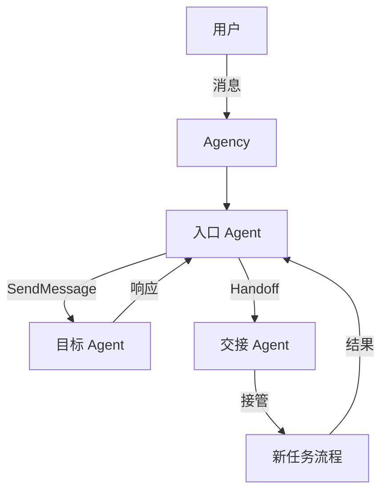

### 通信配置

| 配置项 | 说明 |
|--------|------|
| `communication_flows` | 定义 Agent 之间的通信路径 |
| `shared_instructions` | 所有 Agent 共享的指令 |
| `name` | Agency 的显示名称 |

资料来源：[examples/README.md:1-30]()

## 用户界面

Agency Swarm 提供多种用户界面选项：

### 可视化界面

提供交互式 HTML 可视化，展示 Agent 通信流程和工具关系：

- **节点显示**：Agent（紫色渐变）、工具（橙色渐变）、入口点（绿色渐变）
- **边连接**：带箭头指示通信方向
- **缩放控制**：支持放大、缩小、适应视图
- **统计信息**：实时显示 Agent 数量、工具数量、通信流程数

```python
agency.visualize()  # 在浏览器中打开可视化界面
```

资料来源：[src/agency_swarm/ui/templates/html/visualization.html:1-80]()

### 终端界面（TUI）

基于 Rich 库的终端用户界面：

```python
agency.tui(show_reasoning=True)  # 显示推理过程
```

特点：

- 实时流式响应
- 推理过程可视化
- 终端内交互

资料来源：[examples/interactive/tui.py:50-60]()

### Copilot 界面

基于 Next.js 和 CopilotKit 的 Web 界面：

- 实时主题切换
- 动态内容渲染
- 可扩展的组件系统

## 模型配置

### ModelSettings 参数

| 参数 | 说明 | 适用模型 |
|------|------|----------|
| `temperature` | 采样温度（0-2） | 非推理模型 |
| `top_p` | Top-p 采样 | 非推理模型 |
| `reasoning` | 推理努力级别 | 推理模型 |
| `response_include` | 响应包含内容 | 所有模型 |

### 推理模型配置

```python
from agency_swarm import ModelSettings, Reasoning

model_settings=ModelSettings(
    reasoning=Reasoning(effort="high", summary="auto")
)
```

注意：推理模型（如 o3、o4-mini）不支持 `temperature` 参数；非推理模型不支持 `reasoning` 参数。

资料来源：[src/agency_swarm/utils/create_agent_template.py:1-50]()

## FastAPI 集成

Agency Swarm 提供 FastAPI 集成支持，可将 Agency 部署为 REST API 服务：

### 核心端点

| 端点 | 方法 | 说明 |
|------|------|------|
| `/my-agency/get_response` | POST | 同步响应 |
| `/my-agency/get_response_stream` | POST | SSE 流式响应 |
| `/my-agency/get_metadata` | GET | Agency 结构元数据 |
| `/openapi.json` | GET | OpenAPI 3.1.0 Schema |
| `/docs` | GET | Swagger UI 文档 |

### 服务工具

```python
from agency_swarm.integrations.fastapi import run_fastapi

app = run_fastapi(
    agencies={"my-agency": create_agency},
    app_token_env="APP_TOKEN",
    return_app=True,
)
```

工具端点自动暴露：

- `POST /tool/<ToolName>` - 执行工具并验证
- `GET /openapi.json` - 完整的 OpenAPI Schema

资料来源：[examples/fastapi_integration/README.md:1-40]()

### OpenClaw 集成

支持作为 OpenClaw 工作器模式运行：

```python
from agency_swarm.integrations.openclaw import attach_openclaw_to_fastapi

attach_openclaw_to_fastapi(app)
```

## 项目结构

```
agency_swarm/
├── agents/                    # Agent 定义目录
│   └── AgentName/
│       ├── AgentName.py      # Agent 主类
│       ├── instructions.md   # 指令文档
│       ├── tools/            # 专用工具
│       └── schemas/          # OpenAPI Schema
├── tools/                    # 通用工具目录
│   └── {category}/
├── ui/                       # 用户界面组件
│   ├── templates/
│   └── demos/
├── integrations/            # 第三方集成
│   ├── fastapi/
│   └── openclaw/
└── utils/                   # 工具函数
```

资料来源：[CONTRIBUTING.md:1-50]()

## 示例与演示

### 核心功能示例

| 示例文件 | 演示内容 |
|----------|----------|
| `multi_agent_workflow.py` | 多 Agent 协作与验证模式 |
| `agency_context.py` | Agent 间数据共享 |
| `streaming.py` | 实时流式响应 |
| `guardrails.py` | 输入输出防护栏 |
| `custom_persistence.py` | 聊天历史持久化 |
| `tools.py` | 工具模式：BaseTool 和 @function_tool |

### 文件处理示例

| 示例文件 | 演示内容 |
|----------|----------|
| `agent_file_storage.py` | 向量存储与文件搜索 |
| `message_attachments.py` | 文件处理与附件 |
| `web_search.py` | 领域过滤的 Web 搜索 |

### 集成示例

| 路径 | 演示内容 |
|------|----------|
| `fastapi_integration/` | FastAPI 服务与客户端 |
| `interactive/` | TUI 和 Copilot 界面 |

## 快速开始

```python
from agency_swarm import Agency, Agent

# 定义 Agent
support = Agent(
    name="SupportAgent",
    description="处理用户请求的入口 Agent",
    instructions="instructions.md",
    tools=[WebSearchTool()],
    model="gpt-5.4-mini",
)

# 创建 Agency
agency = Agency(
    support,
    shared_instructions="全局共享指令"
)

# 运行
if __name__ == "__main__":
    print(agency.get_response_sync("你好！"))
```

## 总结

Agency Swarm 是一个功能完整的 AI Agent 协作框架，其核心优势包括：

1. **简洁的 API 设计**：基于 OpenAI Responses API，入门门槛低
2. **灵活的工具系统**：支持多种工具定义方式和 OpenAPI Schema 转换
3. **多层次的通信**：支持消息传递和任务交接两种模式
4. **丰富的界面选项**：可视化、TUI、Web 界面全覆盖
5. **完善的部署支持**：FastAPI 集成、OpenAPI Schema 生成

该框架适用于构建复杂的多 Agent 工作流、智能客服系统、自动化代理等应用场景。

---

<a id='p-installation'></a>

## 安装与配置

### 相关页面

相关主题：[Agency Swarm 简介](#p-intro), [项目目录结构](#p-folder-structure)

<details>
<summary>相关源码文件</summary>

以下源码文件用于生成本页说明：

- [pyproject.toml](https://github.com/VRSEN/agency-swarm/blob/main/pyproject.toml)
- [Makefile](https://github.com/VRSEN/agency-swarm/blob/main/Makefile)
- [CONTRIBUTING.md](https://github.com/VRSEN/agency-swarm/blob/main/CONTRIBUTING.md)
- [README.md](https://github.com/VRSEN/agency-swarm/blob/main/README.md)
- [src/agency_swarm/utils/create_agent_template.py](https://github.com/VRSEN/agency-swarm/blob/main/src/agency_swarm/utils/create_agent_template.py)
- [examples/interactive/tui.py](https://github.com/VRSEN/agency-swarm/blob/main/examples/interactive/tui.py)
</details>

# 安装与配置

## 概述

本页面详细说明 Agency Swarm 项目的安装流程、依赖管理、项目初始化以及 CLI 工具的配置方法。Agency Swarm 是一个多智能体协作框架，通过定义 Agent、Tool 和通信流来实现复杂的自动化工作流程。正确的安装与配置是确保框架正常运行的前提条件。

---

## 环境准备

### 系统要求

| 要求项 | 说明 |
|--------|------|
| Python 版本 | 3.10+ |
| 包管理器 | pip 或 poetry |
| 操作系统 | macOS、Linux、Windows |

### 创建虚拟环境

建议使用虚拟环境隔离项目依赖，避免与其他项目产生冲突：

```bash
# 使用 venv 创建虚拟环境
python -m venv venv

# 激活虚拟环境
# Linux/macOS
source venv/bin/activate

# Windows
venv\Scripts\activate
```

---

## 安装方式

### 方式一：从源码安装（开发模式）

克隆仓库后，使用 Makefile 安装开发依赖：

```bash
git clone https://github.com/VRSEN/agency-swarm.git
cd agency-swarm

# 安装所有依赖（包括开发依赖）
make sync
```

资料来源：[CONTRIBUTING.md:1]()

### 方式二：通过 pip 安装

```bash
pip install agency-swarm
```

### 方式三：使用 poetry 安装

```bash
poetry install
poetry install --with dev  # 包含开发依赖
```

---

## 项目结构

### 核心目录结构

```
agency_swarm/
├── agents/                    # Agent 定义目录
│   └── AgentName/
│       ├── AgentName.py       # Agent 主类文件
│       ├── __init__.py        # 包初始化文件
│       ├── instructions.md    # Agent 指令文档
│       ├── files/             # 上传文件目录
│       ├── tools/             # 工具目录
│       └── schemas/           # OpenAPI schemas 目录
├── tools/                     # 工具目录
│   └── {category}/
│       └── YourNewTool.py
└── ...
```

资料来源：[CONTRIBUTING.md:1]()

### Agent 目录规范

每个 Agent 必须放置在 `agency_swarm/agents/` 目录下，使用 **CamelCase** 命名规范：

```
agency_swarm/agents/AgentName/
├── files/                  # 上传到 OpenAI 的文件目录
├── tools/                  # Agent 使用的工具目录
├── schemas/                # OpenAPI schemas 目录
├── AgentName.py            # Agent 主类文件
├── __init__.py             # 包初始化文件
└── instructions.md         # Agent 指令文档
```

---

## Agent 创建与配置

### 创建 Agent 类

使用以下模板创建新的 Agent：

```python
from agency_swarm import Agent
from agency_swarm.tools.example import ExampleTool

class AgentName(Agent):
    def __init__(self):
        super().__init__(
            name="AgentName",
            description="Description of the agent",
            instructions="instructions.md",
            tools=[ExampleTool],
        )
```

资料来源：[CONTRIBUTING.md:1]()

### CLI 工具创建 Agent

通过命令行工具快速创建 Agent 模板，支持以下参数：

| 参数 | 类型 | 说明 | 默认值 |
|------|------|------|--------|
| `--name` | str | Agent 名称 | 用户输入 |
| `--description` | str | Agent 描述 | - |
| `--model` | str | 模型名称 | `gpt-5.4` |
| `--reasoning` | str | 推理强度 (`low`/`medium`/`high`) | - |
| `--temperature` | float | 温度参数 | 0.3 |
| `--path` | str | 输出路径 | `./` |
| `--use-txt` | bool | 使用 .txt 格式指令文件 | False |

资料来源：[src/agency_swarm/utils/create_agent_template.py:1]()

### 模型配置

#### 非推理模型配置

```python
from agency_swarm import Agent, ModelSettings
from agency_swarm.util import Reasoning

support = Agent(
    name="SupportAgent",
    model="gpt-5.4-mini",
    model_settings=ModelSettings(
        temperature=0.3,
        reasoning=Reasoning(effort="low", summary="auto")
    ),
)
```

#### 推理模型配置

对于推理模型（如 o1 系列），不支持 `temperature` 参数：

```python
# 推理模型配置示例
model_settings=ModelSettings(
    reasoning=Reasoning(effort="high", summary="auto")
)
```

> ⚠️ 注意：推理模型不支持 `temperature` 参数，框架会自动忽略该参数。

资料来源：[src/agency_swarm/utils/create_agent_template.py:1]()

---

## Agency 初始化配置

### 基本初始化

```python
from agency_swarm import Agency, Agent

ceo = Agent(name="CEO", ...)
developer = Agent(name="Developer", ...)

agency = Agency(ceo, developer)
```

### 带通信流的初始化

```python
from agency_swarm import Agency, Agent
from agency_swarm.agents import Handoff

ceo = Agent(name="CEO", ...)
developer = Agent(name="Developer", ...)

agency = Agency(
    ceo,
    developer,
    communication_flows=[(ceo, developer, Handoff)]
)
```

### 完整配置示例

```python
from agency_swarm import Agency, Agent
from agency_swarm.agents import Handoff
from agency_swarm.util import ModelSettings, Reasoning

def create_demo_agency():
    support = Agent(
        name="Support",
        description="Handles user support requests with web search capabilities",
        instructions="You are a helpful support agent.",
        include_search_results=True,
        tools=[WebSearchTool()],
        model="gpt-5.4-mini",
        model_settings=ModelSettings(
            reasoning=Reasoning(effort="low", summary="auto")
        ),
    )

    math = Agent(
        name="MathAgent",
        description="Handles arithmetic and calculation-heavy requests",
        instructions="You are MathAgent. Use the calculate tool for arithmetic questions.",
        tools=[calculate],
        model="gpt-5.4-mini",
        model_settings=ModelSettings(
            reasoning=Reasoning(effort="high", summary="auto")
        ),
    )

    return Agency(
        support,
        math,
        communication_flows=[(support, math, Handoff)],
        shared_instructions="Demonstrate reasoning, web search, file search, and handoffs.",
    )
```

资料来源：[examples/interactive/tui.py:1]()

---

## 测试与验证

### 运行测试

```bash
# 运行测试并生成覆盖率报告
make coverage
```

### 检查覆盖率

`make coverage` 命令会输出测试覆盖率信息，请审查以确保有足够的测试覆盖。

资料来源：[CONTRIBUTING.md:1]()

---

## 工具创建与配置

### 工具目录结构

```
agency_swarm/tools/{category}/
├── YourNewTool.py          # 工具主类文件
└── __init__.py             # 包初始化文件
```

工具应放置在特定类别目录下，如 `coding`、`browsing`、`investing` 等。

### 工具测试

在 `agency_swarm/tests/test_tools.py` 中添加测试用例：

```python
def test_my_tool_example():
    tool = MyCustomTool(example_field="test value")
    result = tool.run()
    assert "expected output" in result
```

资料来源：[CONTRIBUTING.md:1]()

---

## 快速开始流程

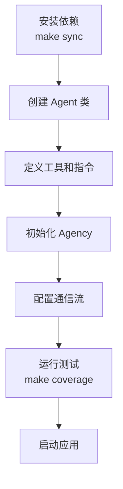

---

## 常见配置问题

| 问题 | 解决方案 |
|------|----------|
| 推理模型报错 | 确保不使用 `temperature` 参数 |
| 工具加载失败 | 检查工具文件路径是否正确 |
| 通信流不工作 | 确认 Agent 实例和 Handoff 配置正确 |

---

<a id='p-architecture'></a>

## 系统架构

### 相关页面

相关主题：[智能体 (Agent)](#p-agents), [代理组织 (Agency)](#p-agencies), [自定义工具开发](#p-tools)

<details>
<summary>相关源码文件</summary>

以下源码文件用于生成本页说明：

- [src/agency_swarm/agent/core.py](https://github.com/VRSEN/agency-swarm/blob/main/src/agency_swarm/agent/core.py)
- [src/agency_swarm/agency/core.py](https://github.com/VRSEN/agency-swarm/blob/main/src/agency_swarm/agency/core.py) （基于 README.md 和 examples 中的引用）
- [src/agency_swarm/tools/base_tool.py](https://github.com/VRSEN/agency-swarm/blob/main/src/agency_swarm/tools/base_tool.py) （基于 examples 和 README.md 中的引用）
- [src/agency_swarm/messages/message_formatter.py](https://github.com/VRSEN/agency-swarm/blob/main/src/agency_swarm/messages/message_formatter.py) （基于 examples 中的引用）
- [examples/agency_visualization.py](https://github.com/VRSEN/agency-swarm/blob/main/examples/agency_visualization.py)
- [examples/interactive/tui.py](https://github.com/VRSEN/agency-swarm/blob/main/examples/interactive/tui.py)
- [examples/custom_send_message.py](https://github.com/VRSEN/agency-swarm/blob/main/examples/custom_send_message.py)
</details>

# 系统架构

## 概述

Agency Swarm 是一个多智能体（Multi-Agent）协作框架，旨在构建能够协同工作的智能体（Agent）系统。该框架的核心设计理念是通过定义清晰的智能体角色、通信流程和工具集，使多个 AI 智能体能够像真实团队一样协作完成任务。

该系统采用分层架构，主要包含以下核心组件：Agent（智能体）、Agency（代理机构）、Tools（工具）、Messages（消息处理）以及各类通信机制。

## 核心架构组件

### 1. Agent（智能体）

Agent 是框架的基本构建单元，每个 Agent 代表一个具有特定角色和职责的 AI 智能体。

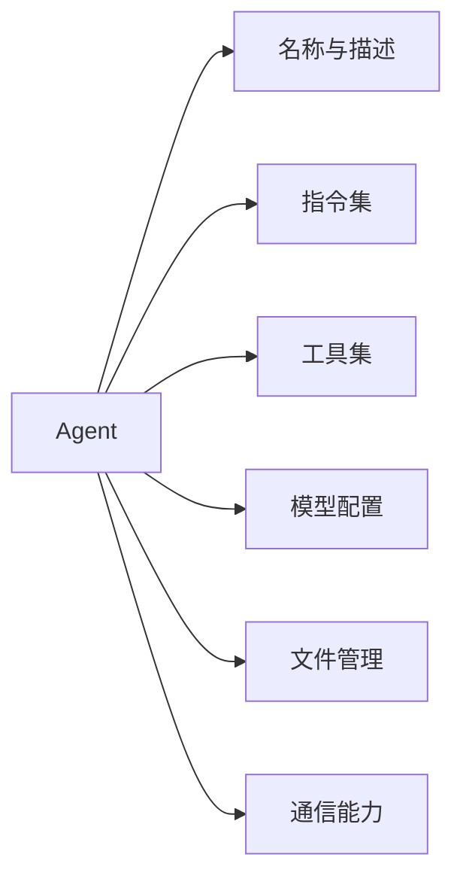

#### Agent 核心属性

| 属性 | 说明 | 必填 |
|------|------|------|
| `name` | 智能体名称，采用 CamelCase 格式 | 是 |
| `description` | 智能体职责描述，供其他 Agent 理解其功能 | 是 |
| `instructions` | 指令文档路径（.md 或 .txt）或直接传入字符串 | 是 |
| `tools` | 智能体可使用的工具列表 | 否 |
| `model` | 使用的模型标识符（如 "gpt-5.4-mini"） | 否 |
| `model_settings` | 模型配置对象 | 否 |
| `files_folder` | 上传至 OpenAI 的文件目录 | 否 |
| `schemas_folder` | OpenAPI schemas 目录，用于自动生成工具 | 否 |

#### Agent 核心方法

```python
# Agent 初始化示例 - 资料来源：examples/interactive/tui.py
ceo = Agent(
    name="CeoAssistant",
    description="Main support agent that assists users",
    instructions="You are CeoAssistant, a helpful AI assistant.",
    files_folder=_files(),
    include_search_results=True,
    tools=[WebSearchTool()],
    model="gpt-5.4-mini",
    model_settings=ModelSettings(reasoning=Reasoning(effort="low", summary="auto")),
)
```

`get_response()` 方法是 Agent 的核心执行入口，处理用户与 Agent 之间以及 Agent 相互之间的交互：

```python
# 资料来源：src/agency_swarm/agent/core.py
async def get_response(
    self,
    message: str | list[TResponseInputItem],
    sender_name: str | None = None,
    context_override: dict[str, Any] | None = None,
    hooks_override: RunHooks | None = None,
    run_config_override: RunConfig | None = None,
    file_ids: list[str] | None = None,
    additional_instructions: str | None = None,
    agency_context: AgencyContext | None = None,
    **kwargs: Any,
) -> RunResult:
```

### 2. Agency（代理机构）

Agency 是多智能体系统的容器，负责管理智能体之间的通信流程和协作关系。

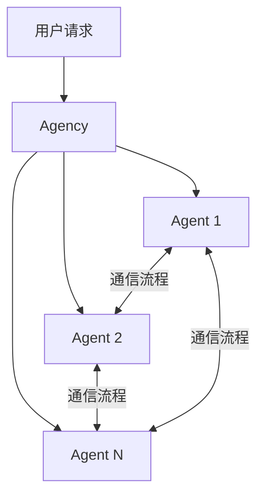

#### Agency 创建模式

Agency 支持两种创建模式：简洁模式（隐式入口点）和显式模式（指定通信流程）：

```python
# 简洁模式 - 资料来源：examples/agency_visualization.py
agency = Agency(ceo)  # ceo 作为入口点

# 显式模式 - 资料来源：examples/custom_send_message.py
agency = Agency(
    coordinator,
    specialist,
    communication_flows=[
        (coordinator > specialist, SendMessageWithContext),
        (specialist > coordinator, Handoff),
    ],
    shared_instructions="Use key decisions to guide analysis tool selection.",
)
```

#### 通信流程配置

| 符号 | 含义 | 用法 |
|------|------|------|
| `>` | 单向通信 | `(A > B)` 表示 A 可以向 B 发送消息 |
| `< >` | 双向通信 | `(A < > B)` 表示 A 和 B 可以相互通信 |
| `, Handoff` | 交接工具 | 指定使用 Handoff 进行消息传递 |

### 3. Tools（工具系统）

工具系统允许 Agent 执行特定操作，是扩展 Agent 能力的关键机制。

```mermaid
graph TB
    T[工具系统] --> T1[BaseTool]
    T --> T2[FunctionTool]
    T --> T3[ToolFactory]
    T1 --> S1[结构化工具类]
    T2 --> D1[@function_tool 装饰器]
    T3 --> O1[OpenAPI 转换]
```

#### 工具类型

**使用 @function_tool 装饰器：**

```python
# 资料来源：examples/README.md
from agency_swarm.tools import function_tool

@function_tool
def calculate(query: str) -> str:
    """A calculator tool for arithmetic questions."""
    return f"Result: {query}"
```

**使用 BaseTool 基类：**

```python
# 资料来源：README.md
from agency_swarm.tools import BaseTool
from pydantic import Field

class MyCustomTool(BaseTool):
    """自定义工具描述，用于帮助 Agent 理解何时使用此工具。"""
    
    example_field: str = Field(
        ..., description="字段描述，说明其用途"
    )
    
    def run(self):
        return "工具操作结果"
```

**从 OpenAPI Schema 生成工具：**

```python
# 资料来源：README.md
from agency_swarm.tools import ToolFactory

tools = ToolFactory.from_openapi_schema(
    openapi_schema_dict
)
```

#### 内置工具

| 工具名称 | 功能 | 资料来源 |
|----------|------|----------|
| `WebSearchTool` | 网页搜索功能 | examples/interactive/tui.py |
| `FileSearchTool` | 向量存储文件搜索 | examples/README.md |
| `IPythonInterpreter` | 代码解释执行 | CLI import-tool 命令 |
| `Handoff` | Agent 交接通信 | examples/custom_send_message.py |
| `SendMessage` | 发送消息通信 | examples/custom_send_message.py |

### 4. Messages（消息处理）

消息系统处理 Agent 之间的通信格式化与传递。

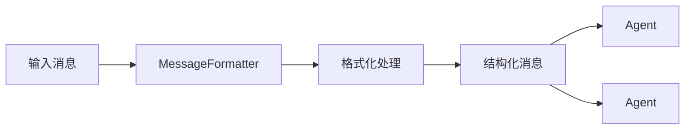

MessageFormatter 负责消息的解析、格式化和传递，确保不同 Agent 之间能够正确理解彼此的意图。

### 5. ModelSettings（模型配置）

模型配置提供了细粒度的模型控制能力：

```python
# 资料来源：examples/interactive/tui.py
from agency_swarm import ModelSettings, Reasoning

ModelSettings(
    reasoning=Reasoning(effort="low", summary="auto"),
    temperature=0.3,
    max_tokens=25000,
    top_p=0.9,
)
```

#### ModelSettings 参数

| 参数 | 说明 | 默认值 |
|------|------|--------|
| `temperature` | 生成随机性控制 | 0.3（非推理模型） |
| `max_tokens` | 最大输出 token 数 | 模型默认值 |
| `top_p` | 核采样概率 | - |
| `reasoning` | 推理配置 | - |

## 目录结构

```
agency_swarm/
├── agency/              # Agency 核心实现
│   └── core.py
├── agent/               # Agent 核心实现
│   └── core.py
├── tools/               # 工具系统
│   ├── base_tool.py
│   ├── function_tool.py
│   └── ...
├── messages/            # 消息处理
│   └── message_formatter.py
├── cli/                 # 命令行工具
│   └── main.py
├── ui/                  # 用户界面
│   ├── templates/
│   └── demos/
└── integrations/       # 集成功能
    └── fastapi_utils/
```

### Agent 目录结构规范

```bash
AgentName/                  # 目录名采用 CamelCase
├── files/                  # 上传至 OpenAI 的文件
├── schemas/                # OpenAPI schemas（自动转工具）
├── tools/                  # Agent 专用工具
├── AgentName.py            # 主类文件
├── __init__.py
└── instructions.md         # 指令文档
```

## 通信机制

### Agent 间通信流程

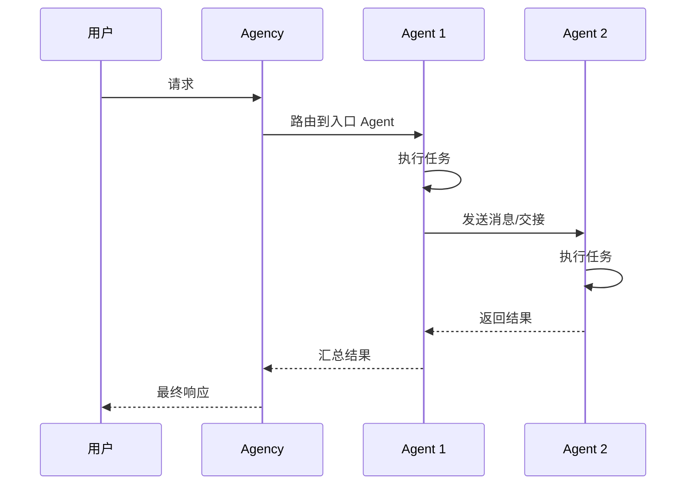

### 通信工具类型

| 通信工具 | 用途 | 特点 |
|----------|------|------|
| `Handoff` | Agent 交接 | 完整上下文传递 |
| `SendMessage` | 发送消息 | 自定义消息格式 |
| `SendMessageWithContext` | 带上下文消息 | 附加额外上下文信息 |

## 执行模式

### 异步执行（推荐）

```python
# 资料来源：README.md
import asyncio

async def main():
    resp = await agency.get_response("Create a project skeleton.")
    print(resp.final_output)

asyncio.run(main())
```

### 同步执行

```python
# 资料来源：examples/README.md
result = agency.get_response_sync("What's your name?")
```

## 模型支持

框架支持多种 OpenAI 模型：

| 模型类型 | 示例 | 特性 |
|----------|------|------|
| 标准模型 | `gpt-5.4-mini` | 支持 temperature 参数 |
| 推理模型 | `o3`, `o4` 系列 | 不支持 temperature，支持 reasoning 配置 |

```python
# 推理模型配置示例 - 资料来源：examples/interactive/tui.py
model_settings=ModelSettings(
    reasoning=Reasoning(effort="high", summary="auto")
)
```

## 扩展机制

### 1. 自定义工具开发

工具应放置在 `agency_swarm/tools/{category}/` 目录下：

```bash
agency_swarm/tools/your-tool-category/
├── YourNewTool.py
└── __init__.py
```

### 2. CLI 工具导入

```bash
# 导入内置工具到项目
agency-swarm import-tool IPythonInterpreter --destination ./tools
```

### 3. 从 Assistants API 迁移

```bash
# 从 settings.json 生成 Agent
agency-swarm migrate-agent path_to_settings.json --output-dir ./agents
```

## 可视化功能

Agency 提供可视化功能用于展示智能体通信结构：

```python
# 资料来源：examples/agency_visualization.py
html_file = agency.visualize(
    output_file="agency.html",
    include_tools=True,
    open_browser=True,
)
```

生成的 HTML 页面包含：
- 智能体节点展示
- 通信流程箭头
- 工具关联显示
- 交互式缩放和拖拽

## 快速开始

```python
# 1. 定义工具
from agency_swarm.tools import function_tool

@function_tool
def calculate(query: str) -> str:
    return f"Result: {query}"

# 2. 创建 Agent
from agency_swarm import Agent

support = Agent(
    name="Support",
    description="帮助用户解决问题",
    instructions="你是客服助手。",
    tools=[calculate],
)

# 3. 创建 Agency
from agency_swarm import Agency

agency = Agency(support)

# 4. 执行任务
result = agency.get_response_sync("计算 345 * 18")
```

## 总结

Agency Swarm 的系统架构围绕四个核心概念构建：**Agent**（执行单元）、**Agency**（协作容器）、**Tools**（能力扩展）和 **Messages**（通信机制）。这种设计使得开发者可以灵活地构建复杂的多智能体系统，通过配置通信流程实现不同角色之间的协作，同时保持代码结构的清晰和可维护性。

---

<a id='p-folder-structure'></a>

## 项目目录结构

### 相关页面

相关主题：[系统架构](#p-architecture), [安装与配置](#p-installation)

<details>
<summary>相关源码文件</summary>

以下源码文件用于生成本页说明：

- [src/agency_swarm](https://github.com/VRSEN/agency-swarm/blob/main/src/agency_swarm)
- [examples](https://github.com/VRSEN/agency-swarm/blob/main/examples)
- [CONTRIBUTING.md](https://github.com/VRSEN/agency-swarm/blob/main/CONTRIBUTING.md)
- [README.md](https://github.com/VRSEN/agency-swarm/blob/main/README.md)
- [examples/README.md](https://github.com/VRSEN/agency-swarm/blob/main/examples/README.md)
</details>

# 项目目录结构

## 概述

Agency Swarm 是一个多代理协作框架，其项目目录结构经过精心设计，以支持模块化、可扩展的代理系统开发。框架采用清晰的职责分离，将核心功能、工具、代理、用户界面和集成模块分别放置在独立目录中，便于开发者理解和扩展。

## 顶层目录结构

```
agency-swarm/
├── src/agency_swarm/          # 核心源代码
├── examples/                  # 可运行示例
├── docs/                      # 文档
├── Makefile                   # 构建和测试任务
├── CONTRIBUTING.md            # 贡献指南
└── README.md                  # 项目说明
```

## 核心模块结构

`src/agency_swarm/` 是框架的核心代码库，包含以下主要模块：

```
src/agency_swarm/
├── agent/                     # Agent 核心类
├── tools/                     # 内置工具集
├── util/                      # 工具函数
├── cli/                       # 命令行工具
├── ui/                        # 用户界面
├── integrations/             # 第三方集成
└── __init__.py                # 包入口
```

### Agent 核心模块

`agent/` 目录包含框架的核心代理实现：

| 文件 | 用途 |
|------|------|
| `core.py` | Agent 基类实现，包含工具加载、模式解析、文件处理等核心方法 |

Agent 类提供了 `get_response()` 异步方法用于处理对话循环，支持用户与代理之间的交互以及代理到代理的通信。资料来源：[core.py:30-50]()

### 工具模块

`tools/` 目录采用分类组织结构，每个工具类别放置在独立子目录中：

```
agency_swarm/tools/{category}/
├── YourNewTool.py          # 工具类文件
└── __init__.py             # 模块入口
```

可用的工具类别包括但不限于：`coding`、`browsing`、`investing` 等。开发者可通过继承 `BaseTool` 或使用 `@function_tool` 装饰器创建自定义工具。资料来源：[CONTRIBUTING.md]()

### 用户界面模块

`ui/` 目录包含交互式界面组件：

```
src/agency_swarm/ui/
├── templates/                  # HTML 模板
│   └── html/
│       └── visualization.html  # 代理可视化模板
└── demos/                     # 演示应用
    └── copilot/               # Copilot UI 演示
```

可视化功能允许用户生成交互式 HTML 页面，展示代理之间的通信流程和工具关系图。资料来源：[visualization.html]()

### 命令行工具

`cli/` 目录包含 TypeScript 编写的 CLI 工具，用于从配置文件生成代理代码：

```
src/agency_swarm/cli/
└── utils/
    └── generate-agent-from-settings.ts  # 代理生成器
```

### 集成模块

`integrations/` 目录提供与外部服务的集成能力：

| 集成 | 说明 |
|------|------|
| FastAPI | 支持流式响应的 API 服务器和客户端示例 |
| OpenClaw | 与 OpenClaw 系统的集成，支持工作区挂载和消息传递 |

## 代理项目结构

当开发者使用 Agency Swarm 创建实际项目时，推荐采用以下目录结构：

```
/your-specified-path/
│
├── agency_manifesto.md         # 代理宣言（代理系统的指导原则）
└── AgentName/                  # 代理专属目录（驼峰命名）
    ├── files/                  # 上传至 OpenAI 的文件
    ├── schemas/                # OpenAPI schemas（自动转换为工具）
    ├── tools/                  # 代理使用的工具
    ├── AgentName.py            # 主代理类文件
    ├── __init__.py             # Python 包初始化
    ├── instructions.md         # 代理指令文档
    └── tools.py                # 自定义工具定义
```

资料来源：[README.md]()

### AgentName.py 结构示例

```python
from agency_swarm import Agent
from agency_swarm.tools.example import ExampleTool

class AgentName(Agent):
    def __init__(self):
        super().__init__(
            name="AgentName",
            description="Description of the agent",
            instructions="./instructions.md",
            tools=[ExampleTool],
        )
```

### 文件夹职责说明

| 文件夹/文件 | 用途 |
|------------|------|
| `files/` | 存放需要上传至 OpenAI 的文件，可用于向量存储和文件搜索工具 |
| `schemas/` | 存放 OpenAPI 规范文件，框架自动将其转换为可调用工具 |
| `tools/` | 存放代理专属工具定义 |
| `instructions.md` | 定义代理的行为准则和任务说明 |
| `agency_manifesto.md` | 定义整个代理系统的工作原则和价值观 |

## 代理通信结构

代理之间的通信通过 `communication_flows` 定义，支持多种通信模式：

```python
from agency_swarm import Agency, Agent, Handoff, SendMessage

agency = Agency(
    ceo,                        # 入口点代理
    specialist,
    communication_flows=[
        (ceo > specialist),     # CEO 向专家发送消息
        (specialist > ceo, Handoff),  # 使用 Handoff 进行交接
    ],
)
```

### 通信流程图

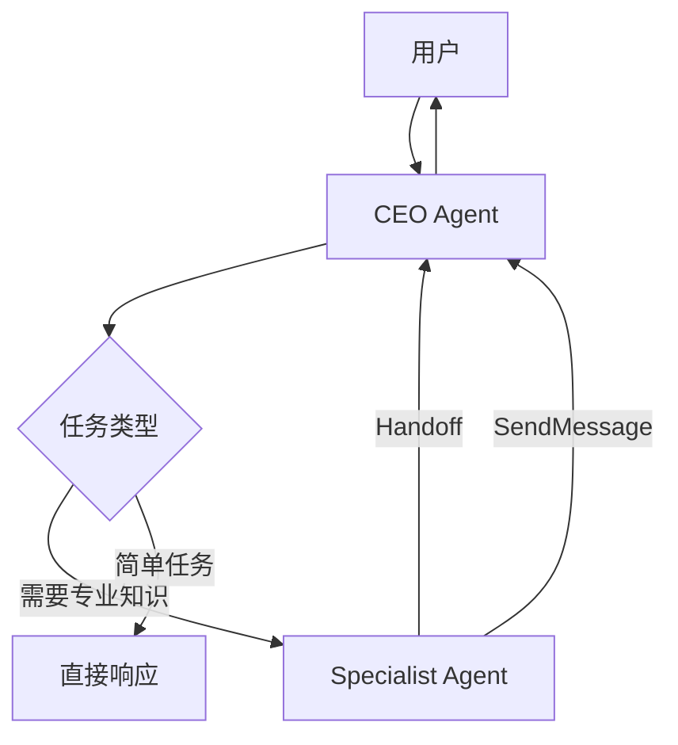

## 示例目录结构

`examples/` 目录包含可运行的演示代码，展示框架的核心功能：

| 示例文件 | 功能说明 |
|---------|---------|
| `multi_agent_workflow.py` | 多代理协作与验证模式 |
| `agency_context.py` | 代理间数据共享 |
| `streaming.py` | 实时流式响应 |
| `guardrails.py` | 输入输出防护 |
| `custom_persistence.py` | 聊天历史持久化 |
| `tools.py` | BaseTool 和 @function_tool 使用 |
| `agent_file_storage.py` | 向量存储和文件搜索 |
| `message_attachments.py` | 文件处理和消息附件 |
| `web_search.py` | WebSearchTool 使用 |
| `custom_send_message.py` | SendMessage 配置 |
| `agency_visualization.py` | 交互式可视化 |

资料来源：[examples/README.md]()

### 交互式示例

```
examples/
├── interactive/
│   ├── tui.py              # 终端 UI 界面
│   ├── copilot_demo.py     # Copilot UI 演示
│   └── hybrid_communication_flows.py  # 混合通信流程
└── fastapi_integration/
    ├── server.py           # FastAPI 服务器
    └── client.py           # 客户端示例
```

## 开发环境配置

### 虚拟环境创建

```bash
python3 -m venv venv
source venv/bin/activate  # Windows: venv\Scripts\activate
```

### 依赖安装

```bash
make sync
```

### 测试运行

```bash
make coverage
```

## 贡献者指南中的结构要求

框架对贡献的代码有明确的目录结构要求：

### 工具贡献结构

```
agency_swarm/tools/your-tool-category/
├── YourNewTool.py          # 主工具类
└── __init__.py             # 导入语句
```

### 代理贡献结构

```
agency_swarm/agents/AgentName/
├── AgentName.py            # 主代理类
├── __init__.py             # 初始化文件
├── instructions.md         # 指令文档
├── files/                  # 文件目录
├── tools/                  # 工具目录
└── schemas/               # schemas 目录
```

## 架构概览图

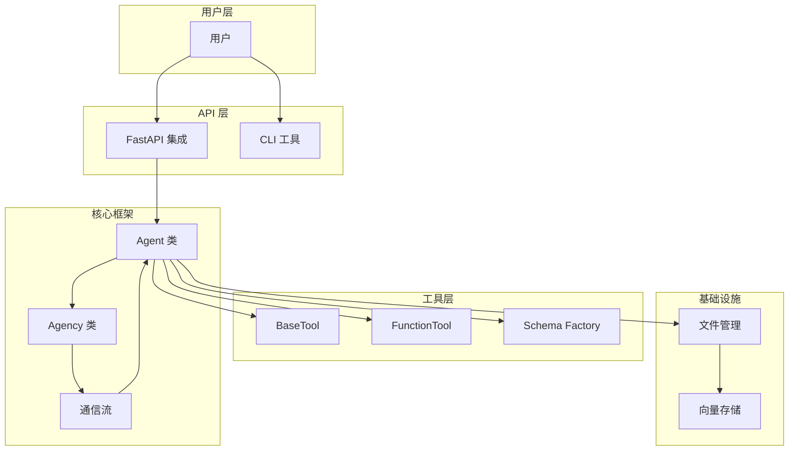

## 总结

Agency Swarm 的目录结构体现了以下设计原则：

1. **模块化设计**：核心功能、工具、界面、集成各自独立
2. **约定优于配置**：代理目录遵循固定命名和结构约定
3. **可扩展性**：工具和代理可轻松添加至对应目录
4. **分离关注点**：文件处理、API 通信、工具定义清晰分离
5. **开发者友好**：示例代码和文档覆盖常见使用场景

开发者应遵循上述目录结构创建新的代理和工具，以便与框架的其他部分无缝集成。

---

<a id='p-agents'></a>

## 智能体 (Agent)

### 相关页面

相关主题：[代理组织 (Agency)](#p-agencies), [自定义工具开发](#p-tools), [通信流程](#p-communication-flows)

<details>
<summary>相关源码文件</summary>

以下源码文件用于生成本页说明：

- [src/agency_swarm/agent/core.py](https://github.com/VRSEN/agency-swarm/blob/main/src/agency_swarm/agent/core.py)
- [src/agency_swarm/agent/execution_helpers.py](https://github.com/VRSEN/agency-swarm/blob/main/src/agency_swarm/agent/execution_helpers.py)
- [src/agency_swarm/agent/tools.py](https://github.com/VRSEN/agency-swarm/blob/main/src/agency_swarm/agent/tools.py)
- [src/agency_swarm/agent/file_manager.py](https://github.com/VRSEN/agency-swarm/blob/main/src/agency_swarm/agent/file_manager.py)
- [examples/custom_send_message.py](https://github.com/VRSEN/agency-swarm/blob/main/examples/custom_send_message.py)
- [examples/agency_visualization.py](https://github.com/VRSEN/agency-swarm/blob/main/examples/agency_visualization.py)
- [CONTRIBUTING.md](https://github.com/VRSEN/agency-swarm/blob/main/CONTRIBUTING.md)
</details>

# 智能体 (Agent)

## 概述

智能体（Agent）是 Agency Swarm 框架的核心构建单元，代表一个具有特定角色、能力边界和行为规范的语言模型实例。每个智能体通过定义其名称、描述、指令集、可用工具及模型配置来确立其在多智能体协作系统中的职责定位。

Agent 类封装了与 OpenAI API 交互的完整逻辑，支持异步消息处理、文件管理、工具调用、通信流控制等核心功能。在 Agency 架构中，智能体之间通过预定义的通信流（Communication Flows）进行消息传递和任务交接，形成协作网络来解决复杂问题。

资料来源：[src/agency_swarm/agent/core.py:1-100]()

## 核心架构

### 类定义与继承结构

Agent 类是所有自定义智能体的基类，开发者通过继承 Agent 并配置其参数来创建特定角色的智能体。框架采用组合模式管理智能体的各个功能模块，包括工具管理器、文件管理器、消息处理器等。

```python
from agency_swarm import Agent

class AgentName(Agent):
    def __init__(self):
        super().__init__(
            name="AgentName",
            description="Description of the agent",
            instructions="instructions.md",
            tools=[ExampleTool],
        )
```

资料来源：[CONTRIBUTING.md](https://github.com/VRSEN/agency-swarm/blob/main/CONTRIBUTING.md)

### 智能体目录结构

遵循规范的目录结构是确保智能体正确加载和运行的前提条件。框架约定每个智能体应放置在 `agency_swarm/agents/` 目录下，并采用 CamelCase 命名规范。

```
agency_swarm/agents/AgentName/
│
├── AgentName/                  # 智能体专属目录
│   ├── files/                  # 上传至 OpenAI 的文件目录
│   ├── tools/                  # 智能体使用的工具目录
│   ├── schemas/                # OpenAPI 架构文件目录
│   ├── AgentName.py            # 核心智能体类文件
│   ├── __init__.py             # Python 包初始化文件
│   └── instructions.md         # 智能体指令文档
```

资料来源：[CONTRIBUTING.md](https://github.com/VRSEN/agency-swarm/blob/main/CONTRIBUTING.md)

## 构造函数参数

### 必需参数

| 参数名 | 类型 | 说明 |
|--------|------|------|
| `name` | str | 智能体的唯一标识名称 |
| `description` | str | 智能体的职责描述，用于上下文理解和任务分配 |
| `instructions` | str | 指令文件路径或内联指令文本，定义智能体行为规范 |

### 可选参数

| 参数名 | 类型 | 默认值 | 说明 |
|--------|------|--------|------|
| `files_folder` | str | None | 本地文件目录路径，这些文件会上传至 OpenAI |
| `schemas_folder` | str | None | OpenAPI 架构文件夹路径，用于自动生成工具 |
| `tools` | list | [] | 智能体可调用的工具列表 |
| `model` | str | "gpt-5.4" | 使用的语言模型标识 |
| `model_settings` | ModelSettings | None | 模型行为配置对象 |
| `output_type` | ResponseFormat | None | 输出格式约束 |
| `output_guardrails` | list | [] | 输出内容校验拦截器 |
| `input_guardrails` | list | [] | 输入内容校验拦截器 |
| `validation_attempts` | int | 1 | 输出验证失败后的重试次数 |

资料来源：[src/agency_swarm/agent/core.py:1-100]()

## 模型配置 (ModelSettings)

ModelSettings 类用于精细控制模型的行为参数，支持的配置项如下：

| 参数名 | 类型 | 说明 |
|--------|------|------|
| `temperature` | float | 采样温度，控制输出的随机性（0.0-2.0） |
| `top_p` | float | Nucleus 采样参数 |
| `max_tokens` | int | 最大输出 token 数量 |
| `reasoning` | Reasoning | 推理能力配置对象 |

### 推理模型配置

对于支持推理能力的模型（如 o1 系列），需使用 `Reasoning` 对象进行配置：

```python
from agency_swarm import Agent, ModelSettings
from openai.types.responses import Reasoning

agent = Agent(
    name="ReasoningAgent",
    description="具有推理能力的智能体",
    instructions="你是一个逻辑分析助手",
    model="gpt-5.4-mini",
    model_settings=ModelSettings(
        reasoning=Reasoning(effort="high", summary="auto")
    ),
)
```

**重要约束**：
- 推理模型（如 o1 系列）**不支持** `temperature` 参数
- 非推理模型**不支持** `reasoning` 参数

资料来源：[src/agency_swarm/utils/create_agent_template.py:1-50]()

## 核心方法

### 异步响应获取

`get_response()` 是智能体的核心执行方法，用于处理用户消息并获取模型响应：

```python
async def get_response(
    self,
    message: str | list[TResponseInputItem],
    sender_name: str | None = None,
    context_override: dict[str, Any] | None = None,
    hooks_override: RunHooks | None = None,
    run_config_override: RunConfig | None = None,
    file_ids: list[str] | None = None,
    additional_instructions: str | None = None,
    agency_context: AgencyContext | None = None,
    **kwargs: Any,
) -> RunResult:
```

该方法支持异步调用，返回 `RunResult` 对象包含完整的执行结果。同步调用可使用 `get_response_sync()` 方法。

资料来源：[src/agency_swarm/agent/core.py:100-150]()

### 文件上传管理

`upload_file()` 方法用于将本地文件上传至 OpenAI 文件存储系统：

```python
def upload_file(self, file_path: str, include_in_vector_store: bool = True) -> str:
    """Upload a file using the agent's file manager."""
    if self.file_manager:
        return self.file_manager.upload_file(file_path, include_in_vector_store)
    raise RuntimeError(f"Agent {self.name} has no file manager configured")
```

上传后的文件可被智能体用于上下文检索、代码解释等场景。

资料来源：[src/agency_swarm/agent/core.py:150-170]()

### 工具自动加载

框架支持从指定文件夹自动加载工具实现：

```python
def _load_tools_from_folder(self) -> None:
    """Load tools defined in ``tools_folder`` and add them to the agent.

    Supports both ``BaseTool`` subclasses and ``FunctionTool``
    instances created via the ``@function_tool`` decorator.
    """
    load_tools_from_folder(self)
```

支持两种工具定义方式：
- 继承 `BaseTool` 抽象类
- 使用 `@function_tool` 装饰器创建 FunctionTool 实例

资料来源：[src/agency_swarm/agent/core.py:80-90]()

### 架构文件解析

`_parse_schemas()` 方法从 `schemas_folder` 目录读取 OpenAPI 架构文件并自动转换为可用工具：

```python
def _parse_schemas(self):
    """Parse OpenAPI schemas from the schemas folder and create tools."""
    parse_schemas(self)
```

这一功能使智能体能够通过自然语言调用外部 API 服务。

资料来源：[src/agency_swarm/agent/core.py:92-96]()

## 执行上下文与钩子

### 运行钩子 (RunHooks)

RunHooks 允许开发者在智能体执行生命周期的关键节点注入自定义逻辑：

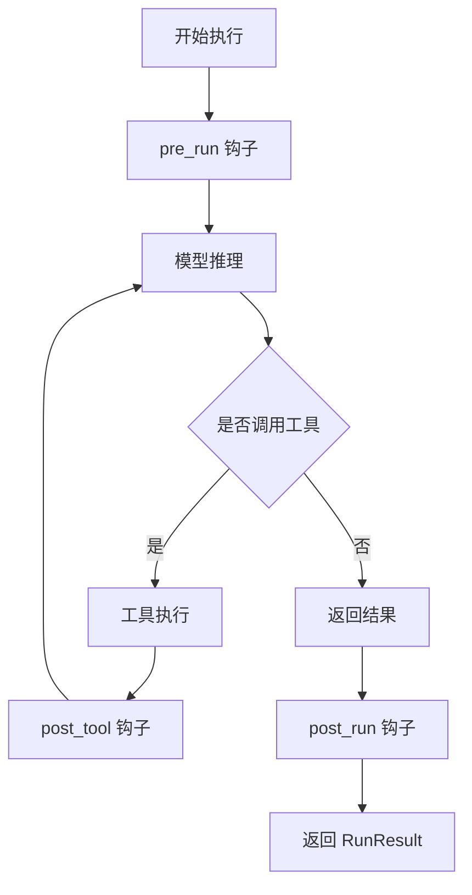

资料来源：[src/agency_swarm/agent/execution_helpers.py:1-50]()

### 运行上下文包装器

`RunContextWrapper` 提供执行上下文的统一访问接口，用于在钩子函数中访问和管理运行时状态：

```python
from agents import RunContextWrapper

# 在钩子中使用
def my_hook(wrapper: RunContextWrapper, **kwargs):
    context = wrapper.context
    # 访问和修改上下文
```

资料来源：[src/agency_swarm/agent/execution_helpers.py:30-60]()

## 执行结果模型

`RunResult` 是智能体执行的核心返回对象，包含丰富的执行元信息：

| 属性 | 类型 | 说明 |
|------|------|------|
| `final_output` | Any | 最终输出内容 |
| `new_items` | list[RunItem] | 执行过程中产生的新项目 |
| `raw_responses` | list | 原始 API 响应 |
| `input_guardrail_results` | list | 输入校验结果 |
| `output_guardrail_results` | list | 输出校验结果 |
| `tool_input_guardrail_results` | list | 工具输入校验结果 |
| `tool_output_guardrail_results` | list | 工具输出校验结果 |
| `context_wrapper` | RunContextWrapper | 执行上下文包装器 |

资料来源：[src/agency_swarm/agent/execution_helpers.py:20-45]()

## 使用示例

### 基础智能体创建

```python
from agency_swarm import Agent, ModelSettings

ceo = Agent(
    name="CEO",
    description="负责客户沟通、任务规划与管理",
    instructions="你必须与其他智能体对话以确保任务完整执行",
    files_folder="./files",
    schemas_folder="./schemas",
    tools=[my_custom_tool],
    model="gpt-5.4-mini",
    model_settings=ModelSettings(
        max_tokens=25000,
    ),
)
```

资料来源：[README.md](https://github.com/VRSEN/agency-swarm/blob/main/README.md)

### 带输出格式的智能体

```python
from agency_swarm import Agent
from pydantic import BaseModel

class ResponseFormat(BaseModel):
    chat_name: str
    message: str

agent = Agent(
    name="Analyzer",
    description="数据分析智能体",
    instructions="分析用户输入并返回结构化结果",
    output_type=ResponseFormat,
    validation_attempts=3,
)
```

### 协作智能体配置

```python
from agency_swarm import Agency, Agent, SendMessage, Handoff

# 创建协调者
coordinator = Agent(
    name="Coordinator",
    description="任务协调者",
    instructions="你负责任务分配和结果汇总",
)

# 创建专家
specialist = Agent(
    name="Specialist",
    description="专业分析智能体",
    tools=[analyze_costs, analyze_performance],
)

# 定义通信流
agency = Agency(
    coordinator,
    specialist,
    communication_flows=[
        (coordinator > specialist, SendMessage),
        (specialist > coordinator, Handoff),
    ],
)
```

资料来源：[examples/custom_send_message.py](https://github.com/VRSEN/agency-swarm/blob/main/examples/custom_send_message.py)

## 可视化

Agency Swarm 提供内置的可视化功能，可生成交互式 HTML 页面展示智能体间的通信拓扑：

```python
agency = Agency(ceo, dev, qa, communication_flows=[...])

html_file = agency.visualize(
    output_file="agency_interactive_demo.html",
    include_tools=True,
    open_browser=True,
)
```

生成的可视化页面支持：
- 拖拽交互
- 缩放控制
- 工具显示/隐藏切换
- 通信流量统计

资料来源：[examples/agency_visualization.py](https://github.com/VRSEN/agency-swarm/blob/main/examples/agency_visualization.py)

## 最佳实践

### 指令编写规范

1. **明确角色边界**：清晰定义智能体的职责范围和决策权限
2. **通信协议**：规定与其他智能体交互的标准格式
3. **错误处理**：定义异常场景下的降级策略
4. **关键约束**：使用 `CRITICAL` 标记必须遵守的行为规则

```python
instructions="""
你的名称是 Coordinator agent。
你协调分析工作。分配任务时，明确决策关注点和所需方法。
CRITICAL: 当你收到专家回复时，必须原样包含其完整回复文本。
不要总结、转述或遗漏任何细节。
"""
```

### 工具设计原则

- 单一职责：每个工具只完成一个明确的任务
- 清晰的输入输出：定义明确的数据结构和返回格式
- 错误处理：工具应捕获并妥善处理异常情况

### 模型选择建议

| 场景 | 推荐模型 | 配置 |
|------|----------|------|
| 简单任务 | gpt-5.4-mini | temperature=0.3 |
| 复杂推理 | gpt-5.4 | temperature=0.7, max_tokens=high |
| 精确输出 | gpt-5.4-mini | temperature=0.0, output_type=json_schema |

资料来源：[examples/interactive/tui.py](https://github.com/VRSEN/agency-swarm/blob/main/examples/interactive/tui.py)

---

<a id='p-agencies'></a>

## 代理组织 (Agency)

### 相关页面

相关主题：[智能体 (Agent)](#p-agents), [通信流程](#p-communication-flows)

<details>
<summary>相关源码文件</summary>

以下源码文件用于生成本页说明：

- [src/agency_swarm/agency/core.py](https://github.com/VRSEN/agency-swarm/blob/main/src/agency_swarm/agency/core.py)
- [src/agency_swarm/agency/setup.py](https://github.com/VRSEN/agency-swarm/blob/main/src/agency_swarm/agency/setup.py)
- [src/agency_swarm/agency/helpers.py](https://github.com/VRSEN/agency-swarm/blob/main/src/agency_swarm/agency/helpers.py)
- [examples/interactive/tui.py](https://github.com/VRSEN/agency-swarm/blob/main/examples/interactive/tui.py)
- [examples/agency_visualization.py](https://github.com/VRSEN/agency-swarm/blob/main/examples/agency_visualization.py)
- [examples/custom_send_message.py](https://github.com/VRSEN/agency-swarm/blob/main/examples/custom_send_message.py)
</details>

# 代理组织 (Agency)

## 概述

Agency 是 Agency Swarm 框架中的核心组件，负责管理和协调多个 Agent 之间的协作交互。作为多代理系统的容器，Agency 封装了代理初始化、通信流配置、消息路由和响应处理等关键功能，使开发者能够构建复杂的多代理工作流。

Agency 的主要职责包括：

- 管理多个 Agent 实例的生命周期
- 定义和维护 Agent 之间的通信流程（Communication Flows）
- 处理代理间的消息传递和上下文共享
- 提供统一的响应接口，支持同步和异步模式
- 支持可视化展示代理组织结构

## 核心架构

### 组件关系图

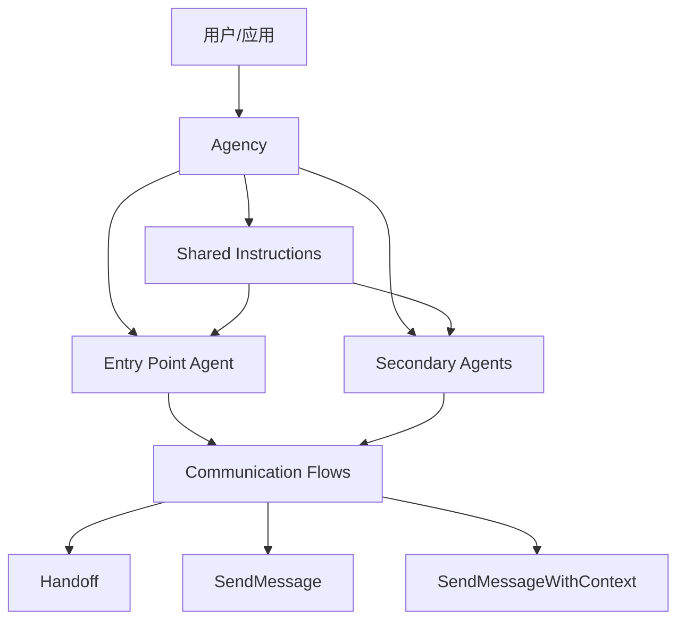

### 关键组件

| 组件 | 说明 |
|------|------|
| **Agent** | 独立的代理单元，拥有自己的工具、指令和模型配置 |
| **Communication Flows** | 定义代理之间的通信模式和所使用的通信工具 |
| **Shared Instructions** | 所有代理共享的全局指令集 |
| **Entry Point Agent** | 作为入口点的代理，接收初始用户请求 |

## 创建代理组织

### 基本语法

Agency 的构造函数接受可变数量的 Agent 作为位置参数，第一个 Agent 自动成为入口点代理：

```python
from agency_swarm import Agency, Agent

# 创建代理
ceo = Agent(name="CEO", ...)
developer = Agent(name="Developer", ...)
qa = Agent(name="QA", ...)

# 创建代理组织
agency = Agency(ceo, developer, qa)
```

### 完整参数配置

```python
agency = Agency(
    ceo,  # 入口点代理（必需）
    developer,
    qa,
    communication_flows=[
        (ceo > developer, Handoff),  # CEO 可以将任务交接给 Developer
        (developer > qa, Handoff),   # Developer 可以将任务交接给 QA
    ],
    shared_instructions="这是代理组织的全局共享指令",
    name="MyAgency",
)
```

## 通信流程配置

### 通信流语法

通信流程使用流式语法定义代理之间的交互模式：

```python
# 基本语法
(agent_a > agent_b, ToolClass)

# 多代理通信
(agent_a < agent_b > agent_c, ToolClass)
```

### 通信工具类型

| 工具类型 | 说明 | 使用场景 |
|----------|------|----------|
| `Handoff` | 代理交接工具，用于完全转移对话控制权 | 任务委派、职责转换 |
| `SendMessage` | 发送消息工具，直接向目标代理发送消息 | 信息传递、请求响应 |
| `SendMessageWithContext` | 带上下文的发送消息工具，传递额外上下文信息 | 需要传递额外数据的消息 |

### 通信流示例

```python
from agency_swarm import Agency, Agent, Handoff, SendMessage, SendMessageWithContext

# 定义代理
coordinator = Agent(name="Coordinator", ...)
specialist = Agent(name="Specialist", ...)

# 创建代理组织并配置通信流
agency = Agency(
    coordinator,
    specialist,
    communication_flows=[
        # Coordinator 可以向 Specialist 发送带上下文的消息
        (coordinator > specialist, SendMessageWithContext),
        # Specialist 可以将任务交接回 Coordinator
        (specialist > coordinator, Handoff),
    ],
)
```

资料来源：[examples/custom_send_message.py:1-50]()

## 共享指令

`shared_instructions` 参数用于定义所有代理共享的全局指令。这些指令会在每个代理初始化时注入，确保所有代理都能访问相同的上下文信息和行为规范。

```python
agency = Agency(
    ceo,
    developer,
    shared_instructions="这是一个软件开发代理组织。所有代理应该遵循代码规范和最佳实践。",
)
```

## 响应处理

### 异步获取响应

```python
import asyncio

async def main():
    resp = await agency.get_response("创建一个小项目骨架")
    print(resp.final_output)

asyncio.run(main())
```

### 同步获取响应

```python
# 同步模式
resp = agency.get_response_sync("创建一个小项目骨架")
print(resp.final_output)
```

### 终端用户界面

Agency 提供了内置的 TUI（终端用户界面）功能：

```python
agency.tui(show_reasoning=True)
```

资料来源：[examples/interactive/tui.py:1-80]()

## 可视化功能

Agency 支持生成交互式的可视化图表，展示代理组织的结构和通信流程：

```python
html_file = agency.visualize(
    output_file="agency_visualization.html",
    include_tools=True,
    open_browser=True,
)
```

可视化功能可以：

- 展示所有代理及其角色
- 显示代理之间的通信流向
- 展示每个代理拥有的工具
- 支持交互式拖拽和缩放

资料来源：[examples/agency_visualization.py:1-60]()

## 工作流程示意

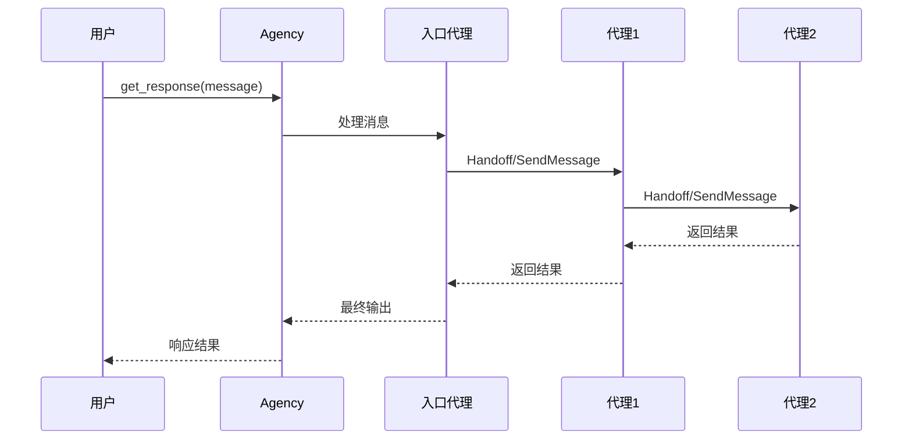

## 完整使用示例

```python
from agency_swarm import Agency, Agent, Handoff, ModelSettings

# 创建支持代理
support = Agent(
    name="Support",
    description="处理客户咨询和技术支持请求",
    instructions="你是技术支持代理。使用搜索工具回答用户问题。",
    tools=[WebSearchTool()],
    model="gpt-4o",
)

# 数学代理
math = Agent(
    name="MathAgent",
    description="处理算术和计算密集型请求",
    instructions="你是数学代理。使用计算工具处理算术问题。",
    tools=[calculate],
    model="gpt-4o",
    model_settings=ModelSettings(temperature=0.7),
)

# 创建代理组织
agency = Agency(
    support,
    math,
    communication_flows=[
        (support < math > support, Handoff),
    ],
    shared_instructions="演示推理、网络搜索和代理交接功能。",
    name="SupportAgency",
)

# 运行
if __name__ == "__main__":
    response = agency.get_response_sync("帮我计算 345 * 18")
    print(response.final_output)
```

## 最佳实践

### 1. 明确的职责划分

每个代理应有清晰的职责定义，通过 `description` 和 `instructions` 参数明确其角色和功能。

### 2. 合理的通信流设计

- 使用 Handoff 进行任务委派和职责转换
- 使用 SendMessage 进行信息查询和响应获取
- 避免过度复杂的通信流，保持流程清晰

### 3. 共享指令的使用

将所有代理需要遵守的通用规则和约束放在 `shared_instructions` 中，避免重复定义。

### 4. 模型配置

根据代理的具体任务类型调整模型参数，如推理强度、token 限制等：

```python
from agency_swarm import ModelSettings, Reasoning

agent = Agent(
    name="Analyst",
    model_settings=ModelSettings(
        reasoning=Reasoning(effort="high", summary="auto"),
    ),
)
```

## 总结

Agency 作为 Agency Swarm 框架的核心组件，提供了一套完整的多代理协作解决方案。通过其灵活的通信流机制、共享指令系统和统一的响应接口，开发者可以轻松构建复杂的代理工作流，实现从简单的任务委托到复杂的多代理协作场景。

---

<a id='p-communication-flows'></a>

## 通信流程

### 相关页面

相关主题：[代理组织 (Agency)](#p-agencies), [智能体 (Agent)](#p-agents)

<details>
<summary>相关源码文件</summary>

以下源码文件用于生成本页说明：

- [src/agency_swarm/agent/agent_flow.py](https://github.com/VRSEN/agency-swarm/blob/main/src/agency_swarm/agent/agent_flow.py)
- [src/agency_swarm/tools/send_message.py](https://github.com/VRSEN/agency-swarm/blob/main/src/agency_swarm/tools/send_message.py)
- [examples/custom_send_message.py](https://github.com/VRSEN/agency-swarm/blob/main/examples/custom_send_message.py)
- [examples/handoffs.py](https://github.com/VRSEN/agency-swarm/blob/main/examples/handoffs.py)
- [examples/agency_visualization.py](https://github.com/VRSEN/agency-swarm/blob/main/examples/agency_visualization.py)
- [src/agency_swarm/ui/templates/html/visualization.html](https://github.com/VRSEN/agency-swarm/blob/main/src/agency_swarm/ui/templates/html/visualization.html)
</details>

# 通信流程

## 概述

通信流程（Communication Flows）是 Agency Swarm 框架中定义多代理之间如何传递消息和任务的核心理念。在 Agency Swarm 中，代理不再孤立工作，而是通过预定义的通信模式实现协作。通信流程允许开发者精确控制代理之间的消息流向、触发条件以及交接逻辑。

Agency Swarm 支持两种主要的通信机制：

1. **直接消息传递（SendMessage）**：代理之间点对点的消息传递
2. **代理交接（Handoff）**：将对话控制权完全转移给另一个代理

资料来源：[examples/agency_visualization.py:32-39]()

## 核心概念

### 代理通信架构

Agency Swarm 采用星型与网状混合的通信架构。Agency 作为顶层容器管理所有代理，通过 `communication_flows` 参数定义代理间的合法通信路径。默认情况下，如果没有定义通信流程，代理只能与用户直接交互。

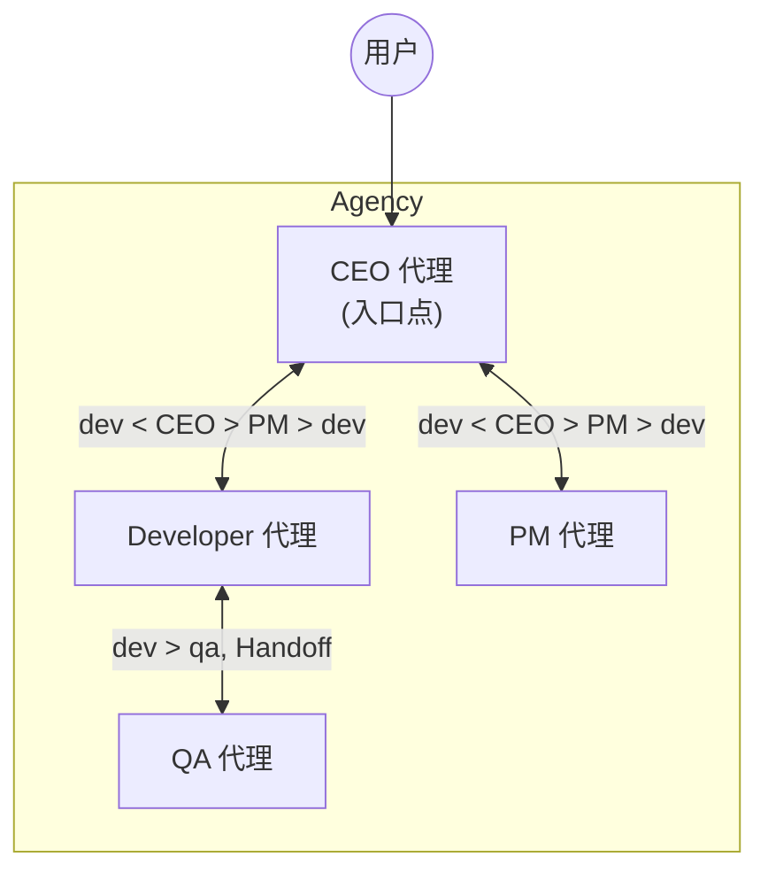

### 入口点代理

入口点代理是用户首次交互的代理，也是消息流的起点。在 Agency 初始化时，第一个参数即为入口点代理。

```python
agency = Agency(
    ceo,  # 入口点代理（位置参数）
    communication_flows=[
        (dev < ceo > pm > dev),
        (dev > qa, Handoff),
    ],
)
```

资料来源：[examples/agency_visualization.py:30-39]()

## 通信流程定义语法

### 符号约定

Agency Swarm 使用简洁的符号语法定义通信流程：

| 符号 | 含义 | 示例 |
|------|------|------|
| `>` | 消息流向右侧代理 | `ceo > dev` 表示 CEO 向 Developer 发送消息 |
| `<` | 消息流向左侧代理 | `dev < ceo` 表示 Developer 接收来自 CEO 的消息 |
| `>>` | Handoff（完全交接） | `dev >> qa` Developer 完全交接给 QA |
| `, Handoff` | 添加 Handoff 机制 | `(dev > qa, Handoff)` |

### 流程模式

#### 直接通信模式

使用 `<` 和 `>` 符号定义双向消息传递：

```python
(dev < ceo > pm > dev)
```

此模式表示：
- Developer 可以接收来自 CEO 的消息
- PM 可以接收来自 CEO 的消息
- Developer 可以向 PM 发送消息

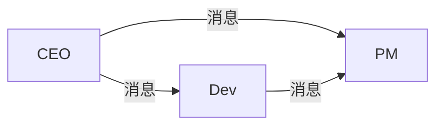

资料来源：[examples/agency_visualization.py:35]()

#### Handoff 模式

Handoff 允许一个代理将对话控制权完全转移给另一个代理：

```python
(dev > qa, Handoff)
```

当 Developer 执行 Handoff 时：
1. Developer 的对话上下文会传递给 QA
2. QA 成为当前活跃代理
3. 用户后续消息由 QA 处理

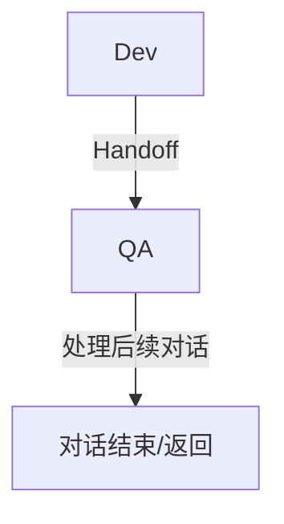

资料来源：[examples/handoffs.py:1-50]()

## SendMessage 工具

SendMessage 是 Agency Swarm 中实现代理间通信的核心工具。每个代理都自动配备此工具，允许向其他代理发送消息。

### 工具定义

```python
class SendMessage(BaseTool):
    """用于向其他代理发送消息的工具"""
    
    recipient_name: str = Field(
        ..., 
        description="消息接收者的名称"
    )
    message: str = Field(
        ..., 
        description="要发送的消息内容"
    )
```

### 使用示例

```python
# 在代理的指令中调用
"""
当需要与 Developer 协作时，请使用 SendMessage 工具。
recipient_name: "Developer"
message: "请帮我实现用户认证功能"
"""
```

资料来源：[src/agency_swarm/tools/send_message.py](https://github.com/VRSEN/agency-swarm/blob/main/src/agency_swarm/tools/send_message.py)

## 自定义通信配置

### SendMessage 配置选项

通过在 Agency 初始化时传递参数，可以自定义 SendMessage 的行为：

| 参数 | 类型 | 默认值 | 说明 |
|------|------|--------|------|
| `shared_context` | dict | None | 所有代理共享的上下文数据 |
| `message_history` | int | 10 | 消息历史保留条数 |
| `timeout` | int | 300 | 消息响应超时（秒） |

### 自定义消息格式

可以自定义发送给其他代理的消息格式：

```python
from agency_swarm import Agency, Agent

ceo = Agent(
    name="CEO",
    instructions="你的指令",
)

dev = Agent(
    name="Developer",
    instructions="你的指令",
)

agency = Agency(
    ceo,
    communication_flows=[
        (ceo > dev),
    ],
    shared_instructions="这是所有代理共享的指令",
)
```

资料来源：[examples/custom_send_message.py](https://github.com/VRSEN/agency-swarm/blob/main/examples/custom_send_message.py)

## Agent Flow 执行流程

### 消息处理生命周期

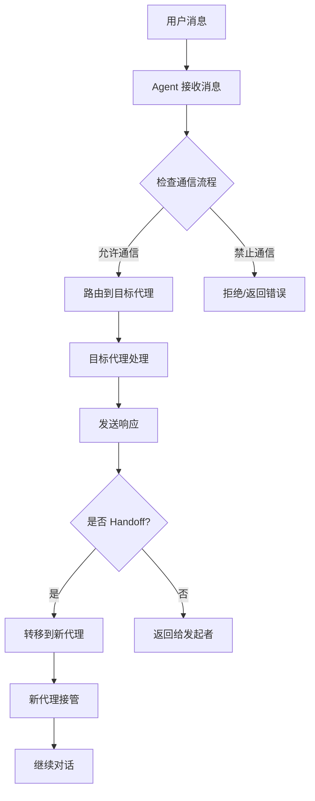

### 异步通信支持

Agency Swarm 支持异步消息处理：

```python
import asyncio

async def main():
    agency = create_agency()
    response = await agency.get_response("创建项目骨架")
    print(response.final_output)

asyncio.run(main())
```

资料来源：[README.md:150-158]()

## 可视化工具

Agency Swarm 提供了内置的可视化功能来展示通信流程：

### 生成可视化

```python
html_file = agency.visualize(
    output_file="agency_interactive_demo.html",
    include_tools=True,
    open_browser=True,
)
```

### 可视化统计

可视化界面显示以下统计信息：

- **代理数量**：Agency 中的代理总数
- **工具数量**：所有代理使用的工具总数
- **通信流数量**：定义的通信流程数量
- **入口点数量**：可作为入口的代理数量

```html
<div class="stats">
    <h4>Agency Statistics</h4>
    <div id="stats-agents">Agents: 0</div>
    <div id="stats-tools">Tools: 0</div>
    <div id="stats-flows">Communication Flows: 0</div>
    <div id="stats-entry-points">Entry Points: 0</div>
</div>
```

资料来源：[src/agency_swarm/ui/templates/html/visualization.html:28-35]()

## 最佳实践

### 通信流程设计原则

1. **明确入口点**：选择一个主控代理作为用户交互的入口
2. **限制直接通信**：只允许必要的代理之间直接通信
3. **使用 Handoff 进行交接**：当代理需要完全移交控制权时使用 Handoff
4. **共享上下文**：使用 `shared_instructions` 传递通用信息

### 示例架构

```python
from agency_swarm import Agent, Agency, Handoff

# 定义代理
ceo = Agent(name="CEO", instructions="管理任务规划")
dev = Agent(name="Developer", instructions="编写代码")
qa = Agent(name="QA", instructions="测试软件")
pm = Agent(name="PM", instructions="管理项目进度")

# 定义通信流程
agency = Agency(
    ceo,  # 入口点
    communication_flows=[
        # CEO 可以与所有代理通信
        (ceo > dev),
        (ceo > qa),
        (ceo > pm),
        # Developer 与 PM 协作
        (dev < pm > dev),
        # Developer 向 QA 交接
        (dev > qa, Handoff),
        # QA 向 CEO 报告
        (qa > ceo),
    ],
)
```

### 注意事项

- 确保通信流程形成闭环，避免消息丢失
- Handoff 会传递完整的对话上下文，包括消息历史
- 使用可视化工具验证通信流程是否符合预期

## 相关资源

- [Agent Flow 源码](https://github.com/VRSEN/agency-swarm/blob/main/src/agency_swarm/agent/agent_flow.py)
- [SendMessage 工具](https://github.com/VRSEN/agency-swarm/blob/main/src/agency_swarm/tools/send_message.py)
- [Handoff 示例](https://github.com/VRSEN/agency-swarm/blob/main/examples/handoffs.py)
- [自定义通信示例](https://github.com/VRSEN/agency-swarm/blob/main/examples/custom_send_message.py)
- [交互式工作流示例](https://github.com/VRSEN/agency-swarm/blob/main/examples/interactive/hybrid_communication_flows.py)

---

<a id='p-tools'></a>

## 自定义工具开发

### 相关页面

相关主题：[内置工具](#p-builtin-tools), [智能体 (Agent)](#p-agents), [OpenAPI 工具集成](#p-openapi)

<details>
<summary>相关源码文件</summary>

以下源码文件用于生成本页说明：

- [README.md](https://github.com/VRSEN/agency-swarm/blob/main/README.md)
- [examples/tools.py](https://github.com/VRSEN/agency-swarm/blob/main/examples/tools.py)
- [CONTRIBUTING.md](https://github.com/VRSEN/agency-swarm/blob/main/CONTRIBUTING.md)
- [src/agency_swarm/agent/core.py](https://github.com/VRSEN/agency-swarm/blob/main/src/agency_swarm/agent/core.py)
- [examples/interactive/tui.py](https://github.com/VRSEN/agency-swarm/blob/main/examples/interactive/tui.py)
- [src/agency_swarm/integrations/README.md](https://github.com/VRSEN/agency-swarm/blob/main/src/agency_swarm/integrations/README.md)
</details>

# 自定义工具开发

## 概述

Agency Swarm 框架提供了灵活的自定义工具开发机制，允许开发者创建可被 AI Agent 调用的工具。通过自定义工具，Agent 可以执行特定的业务逻辑、访问外部 API、操作文件系统或执行计算任务。工具是 Agent 与外部世界交互的核心桥梁，使得多智能体系统能够完成复杂的工作流程。

## 工具开发方式

Agency Swarm 支持两种主要的工具创建方式：使用 `@function_tool` 装饰器和继承 `BaseTool` 基类。

### 使用 @function_tool 装饰器

`@function_tool` 装饰器是最简单的工具创建方式，适用于轻量级的工具开发。通过装饰一个普通 Python 函数，可以快速将其转换为可被 Agent 调用的工具。

```python
from agency_swarm.tools import function_tool

@function_tool
def calculate(a: float, b: float) -> str:
    """Performs arithmetic calculation on two numbers.
    
    Args:
        a: First number
        b: Second number
    """
    return str(a + b)
```

这种方法的优势在于代码简洁、学习曲线平缓，适合实现简单的计算或数据转换逻辑。装饰器会自动处理参数解析和返回值格式化。

### 使用 BaseTool 基类

`BaseTool` 提供了更强大的工具开发能力，适合需要复杂验证、状态管理或多步骤执行的工具。通过继承 `BaseTool` 并实现 `run` 方法，开发者可以构建功能完整的工具。

```python
from agency_swarm.tools import BaseTool
from pydantic import Field

class MyCustomTool(BaseTool):
    """
    A brief description of what the custom tool does.
    The docstring should clearly explain the tool's purpose and functionality.
    It will be used by the agent to determine when to use this tool.
    """

    example_field: str = Field(
        ..., description="Description of the example field, explaining its purpose and usage for the Agent."
    )

    def run(self):
        """
        The implementation of the run method, where the tool's main functionality is executed.
        """
        # Your custom tool logic goes here
        return f"Result: {self.example_field}"
```

## 工具架构

### 类层次结构

Agency Swarm 的工具系统采用分层架构设计：

```mermaid
graph TD
    A[Python Function] --> B[@function_tool Decorator]
    A --> C[BaseTool Class]
    C --> D[Tool Validation]
    C --> E[Parameter Parsing]
    C --> F[run Method]
    B --> G[FunctionToolCompat]
    G --> F
    D --> H[Error Handling]
    E --> H
```

### 工具加载流程

工具通过 Agent 的 `tools` 参数进行绑定，并在初始化时完成加载和验证：

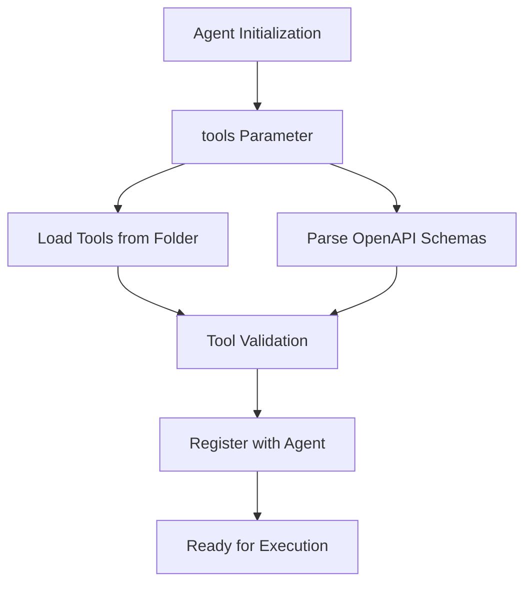

## 工具目录结构

按照项目贡献规范，自定义工具应放置在 `agency_swarm/tools/{category}/` 目录下：

```
agency_swarm/tools/your-tool-category/
│
├── YourNewTool.py          # 工具主类文件
└── __init__.py             # 工具包初始化文件
```

工具类别可以包括 `coding`、`browsing`、`investing` 等，每个类别对应特定领域的工具集合。

## 工具使用示例

### 在 Agent 中使用工具

```python
from agency_swarm import Agent
from agency_swarm.tools.example import ExampleTool

class AgentName(Agent):
    def __init__(self):
        super().__init__(
            name="AgentName",
            description="Description of the agent",
            instructions="./instructions.md",
            tools=[ExampleTool],
        )
```

### 完整示例：多工具 Agent

```python
from agency_swarm import Agent, Agency
from agency_swarm.tools import BaseTool, function_tool
from pydantic import Field

# 使用 BaseTool 创建自定义工具
class WebSearchTool(BaseTool):
    """执行网络搜索并返回结果"""
    query: str = Field(..., description="搜索查询关键词")
    
    def run(self):
        # 实现搜索逻辑
        return f"搜索结果: {self.query}"

# 使用 function_tool 创建计算工具
@function_tool
def calculate(a: float, b: float) -> str:
    """执行算术运算"""
    return str(a + b)

# 创建使用工具的 Agent
support = Agent(
    name="SupportAgent",
    description="处理用户请求并提供信息",
    instructions="你是支持代理，可以搜索网络和执行计算",
    tools=[WebSearchTool, calculate],
    model="gpt-5.4-mini",
)
```

## OpenAPI 架构转换

Agency Swarm 提供了 `ToolFactory` 用于从 OpenAPI 规范自动生成工具。这一功能使得集成第三方 API 变得简单高效：

```python
from agency_swarm.tools import ToolFactory

# 从本地文件加载
with open("schemas/your_schema.json") as f:
    tools = ToolFactory.from_openapi_schema(f.read())

# 从远程 API 获取
import requests
tools = ToolFactory.from_openapi_schema(
    requests.get("https://api.example.com/openapi.json").json(),
)
```

## 工具测试

### 测试框架

每个工具应在 `agency_swarm/tests/test_tools.py` 中添加对应的测试用例：

```python
def test_my_tool_example():
    tool = MyCustomTool(example_field="test value")
    result = tool.run()
    assert "expected output" in result
```

### 测试执行

使用 Makefile 运行测试覆盖率：

```bash
make coverage
```

## 配置参数

### BaseTool 字段定义

| 参数 | 类型 | 必填 | 说明 |
|------|------|------|------|
| `Field(...)` | Any | 是 | 使用 Pydantic Field 定义工具参数 |
| `description` | str | 是 | 参数描述，供 Agent 理解何时使用 |
| `default` | Any | 否 | 参数默认值 |

### Agent 工具配置

| 参数 | 说明 |
|------|------|
| `tools` | 工具类列表或 BaseTool 实例列表 |
| `tools_folder` | 从指定文件夹自动加载工具 |

## 工具与 Agent 通信

Agent 可以通过以下方式使用工具：

1. **直接调用**：Agent 根据任务需求选择合适的工具
2. **工具链**：多个工具按顺序执行完成复杂任务
3. **条件调用**：基于上下文条件决定是否调用特定工具

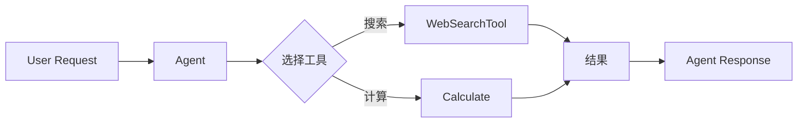

## 最佳实践

1. **清晰的描述**：为每个工具编写清晰的文档字符串，说明其用途和使用场景
2. **精确的参数描述**：使用 Pydantic Field 的 description 参数详细说明每个参数
3. **错误处理**：在 `run` 方法中实现适当的错误处理和边界情况处理
4. **返回格式**：返回易于 Agent 理解和处理的结果格式
5. **测试覆盖**：为每个工具编写完整的测试用例

## 相关资源

- [工具基础类源码](../src/agency_swarm/tools/base_tool.py)
- [工具工厂源码](../src/agency_swarm/tools/tool_factory.py)
- [函数工具兼容性](../src/agency_swarm/tools/function_tool_compat.py)
- [工具使用示例](../examples/tools.py)
- [交互式示例](../examples/interactive/tui.py)

---

<a id='p-builtin-tools'></a>

## 内置工具

### 相关页面

相关主题：[自定义工具开发](#p-tools), [OpenAPI 工具集成](#p-openapi)

<details>
<summary>相关源码文件</summary>

以下源码文件用于生成本页说明：

- [src/agency_swarm/tools/built_in/IPythonInterpreter.py](https://github.com/VRSEN/agency-swarm/blob/main/src/agency_swarm/tools/built_in/IPythonInterpreter.py)
- [src/agency_swarm/tools/built_in/LoadFileAttachment.py](https://github.com/VRSEN/agency-swarm/blob/main/src/agency_swarm/tools/built_in/LoadFileAttachment.py)
- [src/agency_swarm/tools/built_in/PersistentShellTool.py](https://github.com/VRSEN/agency-swarm/blob/main/src/agency_swarm/tools/built_in/PersistentShellTool.py)
- [src/agency_swarm/tools/built_in/PresentFiles.py](https://github.com/VRSEN/agency-swarm/blob/main/src/agency_swarm/tools/built_in/PresentFiles.py)
</details>

# 内置工具

## 概述

Agency Swarm 框架提供了一组内置工具（Built-in Tools），位于 `src/agency_swarm/tools/built_in/` 目录下。这些工具是预实现的、可复用的功能模块，旨在为智能体（Agent）提供常用的系统级能力，包括代码执行、文件处理和Shell命令操作。

内置工具的主要特点包括：

- **开箱即用**：无需额外配置即可在智能体中使用
- **统一接口**：所有工具继承自 `BaseTool` 基类，保持接口一致性
- **可扩展性**：开发者可以基于现有工具模式创建自定义工具
- **工具生态**：按类别组织在 `tools/` 目录下的不同子目录中

```资料来源：[examples/README.md](https://github.com/VRSEN/agency-swarm/blob/main/examples/README.md)```

## 工具架构

### 工具基类

Agency Swarm 中的工具主要基于两个核心组件：

1. **BaseTool**：Pydantic 模型形式的工具基类，需要定义输入字段并实现 `run()` 方法
2. **@function_tool 装饰器**：函数式工具定义方式，更轻量级

所有内置工具均继承自 `BaseTool` 类，通过 Pydantic 的 `Field` 定义工具参数，并实现 `run()` 方法执行具体逻辑。

```python
from agency_swarm.tools import BaseTool
from pydantic import Field

class MyCustomTool(BaseTool):
    """工具描述文档字符串"""
    
    example_field: str = Field(
        ..., 
        description="字段用途说明"
    )
    
    def run(self):
        return f"Result: {self.example_field}"
```

```资料来源：[README.md](https://github.com/VRSEN/agency-swarm/blob/main/README.md)```

### 工具加载机制

工具可以从以下来源加载到智能体：

- **tools 参数**：直接在智能体初始化时传入工具类或实例列表
- **tools_folder**：指定文件夹路径，自动加载该目录下的所有工具
- **schemas_folder**：解析 OpenAPI schema 并自动生成工具

```python
class AgentName(Agent):
    def __init__(self):
        super().__init__(
            name="AgentName",
            description="Description of the agent",
            instructions="instructions.md",
            tools=[ExampleTool],  # 直接传入工具
        )
```

```资料来源：[CONTRIBUTING.md](https://github.com/VRSEN/agency-swarm/blob/main/CONTRIBUTING.md)```

## 内置工具详解

### PersistentShellTool

**功能概述**：持久化Shell命令执行工具，允许智能体在连续会话中执行操作系统命令。

**核心特性**：

- **持久化状态**：维护命令执行的工作目录上下文
- **超时保护**：默认超时时间为 5 分钟
- **目录变更检测**：自动检测并警告目录变更情况
- **格式化输出**：清晰展示标准输出、标准错误和返回码

**输出格式**：

```python
# 成功执行示例
**Output:**
```
<命令输出内容>
```

# Stderr:
```
<错误输出内容>
```

**Exit Code:** 0

**Working Directory:** `/current/path`

# 错误执行示例
❌ Error: Command timed out after 5 minutes

**Working Directory:** `/current/path`
```

**关键实现细节**：

- 使用 `subprocess.Popen` 执行命令
- 通过 `communicate()` 方法获取输出
- 捕获 `TimeoutExpired` 异常处理超时情况
- 跟踪 `cwd`（当前工作目录）状态

```资料来源：[src/agency_swarm/tools/built_in/PersistentShellTool.py](https://github.com/VRSEN/agency-swarm/blob/main/src/agency_swarm/tools/built_in/PersistentShellTool.py)```

### IPythonInterpreter

**功能概述**：交互式 Python 代码解释器，用于在智能体中执行 Python 代码。

**典型应用场景**：

- 数据分析和计算任务
- 原型开发和测试
- 科学计算和可视化

**使用方式**：

```python
from agency_swarm import Agent
from agency_swarm.tools.built_in import IPythonInterpreter

agent = Agent(
    name="CodeAgent",
    description="Executes Python code",
    tools=[IPythonInterpreter],
)
```

### LoadFileAttachment

**功能概述**：文件附件加载工具，用于读取和加载用户上传的文件内容。

**主要职责**：

- 从向量存储中检索相关文件
- 解析不同格式的文件内容
- 返回文件内容供智能体处理

### PresentFiles

**功能概述**：文件展示工具，用于向用户或调用方呈现文件内容。

**使用场景**：

- 生成报告文件
- 导出分析结果
- 创建可视化内容

### WebSearchTool

**功能概述**：网络搜索工具，支持域过滤的网页搜索并提取源URL。

```python
from agency_swarm.tools import WebSearchTool

agent = Agent(
    name="SearchAgent",
    tools=[WebSearchTool],
    # 可以在此指定搜索域过滤器
)
```

```资料来源：[examples/web_search.py](https://github.com/VRSEN/agency-swarm/blob/main/examples/web_search.py)```

## 工具使用流程

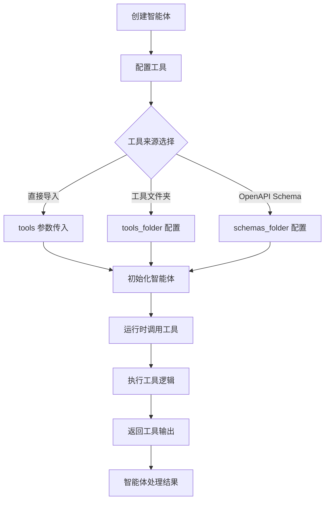

## 内置工具列表

| 工具名称 | 类型 | 功能描述 | 主要依赖 |
|---------|------|---------|---------|
| PersistentShellTool | BaseTool | 持久化Shell命令执行 | subprocess |
| IPythonInterpreter | BaseTool | Python代码解释器 | IPython, Jedi |
| LoadFileAttachment | BaseTool | 文件附件加载 | - |
| PresentFiles | BaseTool | 文件内容展示 | - |
| WebSearchTool | BaseTool | 网络搜索 | requests |

## 工具导入方式

### 方式一：直接导入

```python
from agency_swarm.tools.built_in import PersistentShellTool
from agency_swarm.tools.built_in import IPythonInterpreter
```

### 方式二：导入全部内置工具

```python
from agency_swarm.tools.built_in import *
```

### 方式三：通过 CLI 导入到项目

```bash
agency-swarm import-tool PersistentShellTool --destination ./my_tools
```

```资料来源：[src/agency_swarm/cli/main.py](https://github.com/VRSEN/agency-swarm/blob/main/src/agency_swarm/cli/main.py)```

## 工具目录结构

```
agency_swarm/tools/
├── __init__.py
├── built_in/
│   ├── __init__.py
│   ├── PersistentShellTool.py
│   ├── IPythonInterpreter.py
│   ├── LoadFileAttachment.py
│   └── PresentFiles.py
├── coding/
│   ├── __init__.py
│   └── ...
├── browsing/
│   ├── __init__.py
│   └── ...
└── investing/
    ├── __init__.py
    └── ...
```

每个工具目录下必须包含 `__init__.py` 文件以确保工具可被正确导入。

```资料来源：[CONTRIBUTING.md](https://github.com/VRSEN/agency-swarm/blob/main/CONTRIBUTING.md)```

## 自定义工具开发

开发者可以参考内置工具的实现模式创建自定义工具：

### BaseTool 模式

```python
from agency_swarm.tools import BaseTool
from pydantic import Field
from typing import Type

class MyTool(BaseTool):
    """自定义工具描述"""
    
    input_param: str = Field(
        ..., 
        description="参数描述"
    )
    
    def run(self):
        # 工具实现逻辑
        return f"Processed: {self.input_param}"
    
    @classmethod
    def get_schema(cls) -> dict:
        # 返回工具的JSON Schema
        return cls.model_json_schema()
```

### @function_tool 装饰器模式

```python
from agency_swarm.tools import function_tool

@function_tool
def my_simple_tool(param: str) -> str:
    """工具描述"""
    return f"Result: {param}"
```

```资料来源：[examples/tools.py](https://github.com/VRSEN/agency-swarm/blob/main/examples/tools.py)```

## 工具测试

为确保内置工具的稳定性，建议添加单元测试：

```python
def test_my_tool_example():
    from agency_swarm.tools.built_in import MyCustomTool
    
    tool = MyCustomTool(example_field="test value")
    result = tool.run()
    assert "expected output" in result
```

测试文件应位于 `agency_swarm/tests/test_tools.py`。

```资料来源：[CONTRIBUTING.md](https://github.com/VRSEN/agency-swarm/blob/main/CONTRIBUTING.md)```

## 多模态工具输出

内置工具还支持多模态输出，包括图片和文件：

```python
from agency_swarm.tools.utils import (
    tool_output_image_from_path,
    tool_output_file_from_url
)
from agency_swarm import ToolOutputImage, ToolOutputFileContent

class LoadShowcaseImage(BaseTool):
    """返回图片作为多模态输出"""
    
    path: Path = Field(default=DATA_DIR / "image.png")
    
    def run(self) -> ToolOutputImage:
        return tool_output_image_from_path(self.path)
```

```资料来源：[examples/multimodal_outputs.py](https://github.com/VRSEN/agency-swarm/blob/main/examples/multimodal_outputs.py)```

## 配置与调优

### 模型设置与工具配合

工具执行可以与模型推理策略配合使用：

```python
from agency_swarm import Agent, ModelSettings, Reasoning

agent = Agent(
    name="MathAgent",
    tools=[calculate],
    model="gpt-5.4-mini",
    model_settings=ModelSettings(
        reasoning=Reasoning(effort="high", summary="auto")
    ),
)
```

```资料来源：[examples/interactive/tui.py](https://github.com/VRSEN/agency-swarm/blob/main/examples/interactive/tui.py)```

## 最佳实践

1. **工具选择**：根据任务类型选择合适的内置工具，避免工具滥用
2. **参数验证**：使用 Pydantic Field 的 description 为模型提供清晰的参数说明
3. **错误处理**：实现健壮的异常捕获和错误消息返回
4. **超时控制**：对于可能长时间运行的操作设置合理的超时时间
5. **输出格式化**：返回结构化的输出，便于后续处理和展示

## 相关资源

- [工具开发指南](../development/tools.md)
- [智能体配置](../guides/agents.md)
- [OpenAPI Schema 转工具](./openapi-tools.md)
- [工具测试](../testing/tools-testing.md)

---

<a id='p-openapi'></a>

## OpenAPI 工具集成

### 相关页面

相关主题：[自定义工具开发](#p-tools), [内置工具](#p-builtin-tools)

<details>
<summary>相关源码文件</summary>

以下源码文件用于生成本页说明：

- [src/agency_swarm/tools/tool_factory_utils/factory.py](https://github.com/VRSEN/agency-swarm/blob/main/src/agency_swarm/tools/tool_factory_utils/factory.py)
- [examples/fastapi_integration/README.md](https://github.com/VRSEN/agency-swarm/blob/main/examples/fastapi_integration/README.md)
- [README.md](https://github.com/VRSEN/agency-swarm/blob/main/README.md)
- [src/agency_swarm/tools/tool_factory_utils/openapi_exporter.py](https://github.com/VRSEN/agency-swarm/blob/main/src/agency_swarm/tools/tool_factory_utils/openapi_exporter.py)
- [examples/multimodal_outputs.py](https://github.com/VRSEN/agency-swarm/blob/main/examples/multimodal_outputs.py)
</details>

# OpenAPI 工具集成

## 概述

OpenAPI 工具集成是 Agency Swarm 框架中用于将 OpenAPI 规范自动转换为可用工具的核心功能模块。该模块允许开发者通过 `ToolFactory` 类从 OpenAPI Schema 动态生成 `FunctionTool` 实例，使 AI Agent 能够调用外部 API 端点。

主要功能包括：

- **导入**：从 OpenAPI 3.0/3.1 规范生成工具
- **导出**：将工具定义导出为 OpenAPI Schema
- **适配**：支持 BaseTool 到 OpenAPI Schema 的双向转换

资料来源：[factory.py:1-28](https://github.com/VRSEN/agency-swarm/blob/main/src/agency_swarm/tools/tool_factory_utils/factory.py)

## 架构设计

### 核心组件

```
ToolFactory
├── openapi_importer   (导入 OpenAPI Schema)
├── openapi_exporter   (导出为 OpenAPI Schema)
├── base_tool_adapter  (BaseTool 适配器)
├── langchain          (LangChain 工具转换)
├── mcp                (MCP 协议支持)
└── file_loader        (文件加载)
```

ToolFactory 采用门面（Facade）模式设计，将复杂逻辑委托给专门模块处理，保持公共 API 稳定性。资料来源：[factory.py:13-27](https://github.com/VRSEN/agency-swarm/blob/main/src/agency_swarm/tools/tool_factory_utils/factory.py)

### 数据流图

```mermaid
graph TD
    A[OpenAPI JSON/YAML] --> B[openapi_importer]
    B --> C[BaseTool / FunctionTool]
    C --> D[Agent.tools]
    D --> E[API 调用执行]
    
    F[BaseTool 实例] --> G[base_tool_adapter]
    G --> H[OpenAPI Schema]
    H --> I[openapi_exporter]
    I --> J[导出 JSON]
```

## ToolFactory API

### 导入方法

| 方法名 | 说明 | 参数 | 返回值 |
|--------|------|------|--------|
| `from_openapi_schema` | 从 OpenAPI Schema 导入工具 | `schema: dict` | `list[FunctionTool]` |
| `from_openai_schema` | 从 OpenAI 格式 Schema 导入 | `schema: dict` | `list[FunctionTool]` |
| `from_langchain_tools` | 批量转换 LangChain 工具 | `tools: list` | `list[FunctionTool]` |
| `from_langchain_tool` | 转换单个 LangChain 工具 | `tool: Any` | `FunctionTool` |

资料来源：[factory.py:16-23](https://github.com/VRSEN/agency-swarm/blob/main/src/agency_swarm/tools/tool_factory_utils/factory.py)

### 导出方法

| 方法名 | 说明 | 参数 | 返回值 |
|--------|------|------|--------|
| `get_openapi_schema` | 导出为 OpenAPI 3.1.0 Schema | 无 | `dict` |

资料来源：[factory.py:24](https://github.com/VRSEN/agency-swarm/blob/main/src/agency_swarm/tools/tool_factory_utils/factory.py)

### 适配方法

| 方法名 | 说明 | 参数 | 返回值 |
|--------|------|------|--------|
| `adapt_base_tool` | 将 BaseTool 适配为 FunctionTool | `tool: BaseTool` | `FunctionTool` |
| `from_mcp` | 从 MCP 服务器导入工具 | `server_config` | `list[FunctionTool]` |

资料来源：[factory.py:25-26](https://github.com/VRSEN/agency-swarm/blob/main/src/agency_swarm/tools/tool_factory_utils/factory.py)

## 使用方法

### 基础导入流程

```python
from agency_swarm.tools import ToolFactory

# 从本地文件加载
tools = ToolFactory.from_openapi_schema(
    open("./openapi.json").read(),
)

# 从 URL 加载
import requests
tools = ToolFactory.from_openapi_schema(
    requests.get("https://api.example.com/openapi.json").json(),
)
```

资料来源：[README.md:1-15](https://github.com/VRSEN/agency-swarm/blob/main/README.md)

### 在 Agent 中使用

```python
from agency_swarm import Agent
from agency_swarm.tools import ToolFactory

tools = ToolFactory.from_openapi_schema(open("./my-api.json").read())

ceo = Agent(
    name="CEO",
    description="API 管理代理",
    instructions="使用可用工具与外部 API 交互",
    tools=tools,  # 将生成的工具注入 Agent
)
```

### 导出 OpenAPI Schema

```python
from agency_swarm.tools import ToolFactory

# 获取当前工具的 OpenAPI Schema
schema = ToolFactory.get_openapi_schema()

# 打印或保存
import json
print(json.dumps(schema, indent=2))
```

资料来源：[examples/fastapi_integration/README.md:1-15](https://github.com/VRSEN/agency-swarm/blob/main/examples/fastapi_integration/README.md)

### 验证 Schema 一致性

```bash
python print_openapi_schema.py
```

该脚本打印 FastAPI `/openapi.json` 响应和 ToolFactory Schema，便于直接对比差异。

资料来源：[examples/fastapi_integration/README.md:28-35](https://github.com/VRSEN/agency-swarm/blob/main/examples/fastapi_integration/README.md)

## 工具定义结构

### BaseTool 示例

```python
from agency_swarm import BaseTool, ToolOutputImage, ToolOutputFileContent
from pydantic import Field
from pathlib import Path

class LoadShowcaseImage(BaseTool):
    """返回图片作为多模态输出"""
    
    path: Path = Field(
        default=Path("data/image.png"),
        description="要发布的图片路径"
    )
    detail: str = Field(
        default="auto",
        description="视觉模型详细程度"
    )

    def run(self) -> ToolOutputImage:
        return tool_output_image_from_path(self.path, detail=self.detail)
```

资料来源：[examples/multimodal_outputs.py:1-50](https://github.com/VRSEN/agency-swarm/blob/main/examples/multimodal_outputs.py)

### ToolOutput 类型

| 类型 | 用途 | 导入来源 |
|------|------|----------|
| `ToolOutputImage` | 图片输出 | `agency_swarm` |
| `ToolOutputFileContent` | 文件输出 | `agency_swarm` |

## FastAPI 集成

### 工具服务

通过 `run_fastapi(tools=[MyTool])` 可以自动暴露工具端点：

| 端点 | 方法 | 说明 |
|------|------|------|
| `/tool/<ToolName>` | POST | 执行工具并验证 |
| `/openapi.json` | GET | OpenAPI 3.1.0 Schema |
| `/docs` | GET | Swagger UI |
| `/redoc` | GET | ReDoc 文档 |

所有 Schema 包含嵌套的 Pydantic 模型，可直接连接到 Agencii.ai 等平台。

资料来源：[examples/fastapi_integration/README.md:10-20](https://github.com/VRSEN/agency-swarm/blob/main/examples/fastapi_integration/README.md)

### 完整示例

```python
from agency_swarm import Agency, Agent
from agency_swarm.integrations.fastapi import run_fastapi
from agency_swarm.tools import ToolFactory

# 定义 Agent
ceo = Agent(
    name="CEO",
    tools=ToolFactory.from_openapi_schema(open("./api.json").read()),
)

agency = Agency(ceo)

# 启动 FastAPI 服务
app = run_fastapi(
    agencies={"my-agency": agency},
    tools=[CustomTool],  # 额外暴露的工具
    host="0.0.0.0",
    port=8000,
    return_app=True,
)
```

## 工具加载机制

### 从文件夹加载

Agent 可以通过 `tools_folder` 加载自定义工具：

```python
ceo = Agent(
    name="CEO",
    tools_folder="./tools",  # 加载该目录下的所有工具
    schemas_folder="./schemas",  # OpenAPI Schema 目录
)
```

支持的工具类型：

- `BaseTool` 子类
- 使用 `@function_tool` 装饰器创建的 `FunctionTool`

### Schema 解析

```mermaid
graph LR
    A[schemas_folder] --> B[parse_schemas]
    B --> C[OpenAPI Tools]
    C --> D[Agent.tools]
```

## 最佳实践

### 1. Schema 文件组织

```
project/
├── agents/
│   └── ceo.py
├── schemas/
│   ├── github.yaml
│   └── slack.json
├── tools/
│   └── custom_tool.py
└── agency.py
```

### 2. 工具验证

运行测试确保工具正确生成：

```bash
make coverage
```

### 3. OpenAPI Schema 质量

- 确保 Schema 包含完整的参数描述
- 使用 `x-` 扩展字段添加额外元数据
- 验证 Schema 可以被 ToolFactory 正确解析

## 模块依赖关系

```mermaid
graph TD
    ToolFactory --> openapi_importer
    ToolFactory --> openapi_exporter
    ToolFactory --> base_tool_adapter
    ToolFactory --> langchain
    ToolFactory --> mcp
    ToolFactory --> file_loader
    
    openapi_importer --> schema_inspector
    base_tool_adapter --> BaseTool
    BaseTool --> FunctionTool
```

## 导出 API

`get_openapi_schema()` 返回符合 OpenAPI 3.1.0 规范的完整 Schema，包含：

- 所有已注册工具的路径定义
- Pydantic 模型嵌套结构
- 完整的参数和响应定义

这使得 Agency Swarm 工具可以被其他支持 OpenAPI 的系统消费。

资料来源：[examples/fastapi_integration/README.md:15-20](https://github.com/VRSEN/agency-swarm/blob/main/examples/fastapi_integration/README.md)

---

---

## Doramagic 踩坑日志

项目：VRSEN/agency-swarm

摘要：发现 23 个潜在踩坑项，其中 3 个为 high/blocking；最高优先级：安装坑 - 来源证据：Chart Library tool for financial pattern analysis in agent swarms。

## 1. 安装坑 · 来源证据：Chart Library tool for financial pattern analysis in agent swarms

- 严重度：high
- 证据强度：source_linked
- 发现：GitHub 社区证据显示该项目存在一个安装相关的待验证问题：Chart Library tool for financial pattern analysis in agent swarms
- 对用户的影响：可能增加新用户试用和生产接入成本。
- 建议检查：来源问题仍为 open，Pack Agent 需要复核是否仍影响当前版本。
- 防护动作：不得脱离来源链接放大为确定性结论；需要标注适用版本和复核状态。
- 证据：community_evidence:github | cevd_736c9d770ee34419ad2476f2a973e433 | https://github.com/VRSEN/agency-swarm/issues/596 | 来源讨论提到 python 相关条件，需在安装/试用前复核。

## 2. 安装坑 · 来源证据：Feature request: native advisor/executor consult flow for stronger-model escalation

- 严重度：high
- 证据强度：source_linked
- 发现：GitHub 社区证据显示该项目存在一个安装相关的待验证问题：Feature request: native advisor/executor consult flow for stronger-model escalation
- 对用户的影响：可能增加新用户试用和生产接入成本。
- 建议检查：来源问题仍为 open，Pack Agent 需要复核是否仍影响当前版本。
- 防护动作：不得脱离来源链接放大为确定性结论；需要标注适用版本和复核状态。
- 证据：community_evidence:github | cevd_1b01977e66ac46caa8a8b860da5bdafe | https://github.com/VRSEN/agency-swarm/issues/598 | 来源讨论提到 python 相关条件，需在安装/试用前复核。

## 3. 安装坑 · 来源证据：Proposal: ClawMem adapter for thread persistence across sessions

- 严重度：high
- 证据强度：source_linked
- 发现：GitHub 社区证据显示该项目存在一个安装相关的待验证问题：Proposal: ClawMem adapter for thread persistence across sessions
- 对用户的影响：可能增加新用户试用和生产接入成本。
- 建议检查：来源问题仍为 open，Pack Agent 需要复核是否仍影响当前版本。
- 防护动作：不得脱离来源链接放大为确定性结论；需要标注适用版本和复核状态。
- 证据：community_evidence:github | cevd_3bb24559ba48467ab0c8d43d3069d7f1 | https://github.com/VRSEN/agency-swarm/issues/594 | 来源类型 github_issue 暴露的待验证使用条件。

## 4. 安装坑 · 来源证据：CI-level governance checks for swarm agent code

- 严重度：medium
- 证据强度：source_linked
- 发现：GitHub 社区证据显示该项目存在一个安装相关的待验证问题：CI-level governance checks for swarm agent code
- 对用户的影响：可能增加新用户试用和生产接入成本。
- 建议检查：来源显示可能已有修复、规避或版本变化，说明书中必须标注适用版本。
- 防护动作：不得脱离来源链接放大为确定性结论；需要标注适用版本和复核状态。
- 证据：community_evidence:github | cevd_b995c0dfb8a5460caa7cfde16ac1c7a4 | https://github.com/VRSEN/agency-swarm/issues/593 | 来源类型 github_issue 暴露的待验证使用条件。

## 5. 安装坑 · 来源证据：Feature: Runtime governance and compliance audit trails

- 严重度：medium
- 证据强度：source_linked
- 发现：GitHub 社区证据显示该项目存在一个安装相关的待验证问题：Feature: Runtime governance and compliance audit trails
- 对用户的影响：可能增加新用户试用和生产接入成本。
- 建议检查：来源显示可能已有修复、规避或版本变化，说明书中必须标注适用版本。
- 防护动作：不得脱离来源链接放大为确定性结论；需要标注适用版本和复核状态。
- 证据：community_evidence:github | cevd_4bd751455da0479bb37a014ef50934dd | https://github.com/VRSEN/agency-swarm/issues/592 | 来源类型 github_issue 暴露的待验证使用条件。

## 6. 安装坑 · 来源证据：v1.9.0 - Agent Swarm TUI and OpenClaw

- 严重度：medium
- 证据强度：source_linked
- 发现：GitHub 社区证据显示该项目存在一个安装相关的待验证问题：v1.9.0 - Agent Swarm TUI and OpenClaw
- 对用户的影响：可能增加新用户试用和生产接入成本。
- 建议检查：来源显示可能已有修复、规避或版本变化，说明书中必须标注适用版本。
- 防护动作：不得脱离来源链接放大为确定性结论；需要标注适用版本和复核状态。
- 证据：community_evidence:github | cevd_445071ada1ba4d558d4ebea6ec395364 | https://github.com/VRSEN/agency-swarm/releases/tag/v1.9.0 | 来源讨论提到 python 相关条件，需在安装/试用前复核。

## 7. 配置坑 · 来源证据：v1.8.0 — Present and Accounted For

- 严重度：medium
- 证据强度：source_linked
- 发现：GitHub 社区证据显示该项目存在一个配置相关的待验证问题：v1.8.0 — Present and Accounted For
- 对用户的影响：可能影响升级、迁移或版本选择。
- 建议检查：来源显示可能已有修复、规避或版本变化，说明书中必须标注适用版本。
- 防护动作：不得脱离来源链接放大为确定性结论；需要标注适用版本和复核状态。
- 证据：community_evidence:github | cevd_d270ab8e87c945878e308b78a2c8e7e6 | https://github.com/VRSEN/agency-swarm/releases/tag/v1.8.0 | 来源类型 github_release 暴露的待验证使用条件。

## 8. 配置坑 · 来源证据：v1.9.2

- 严重度：medium
- 证据强度：source_linked
- 发现：GitHub 社区证据显示该项目存在一个配置相关的待验证问题：v1.9.2
- 对用户的影响：可能增加新用户试用和生产接入成本。
- 建议检查：来源显示可能已有修复、规避或版本变化，说明书中必须标注适用版本。
- 防护动作：不得脱离来源链接放大为确定性结论；需要标注适用版本和复核状态。
- 证据：community_evidence:github | cevd_2e69c962dcc44fd5a160047df0f18192 | https://github.com/VRSEN/agency-swarm/releases/tag/v1.9.2 | 来源类型 github_release 暴露的待验证使用条件。

## 9. 配置坑 · 来源证据：v1.9.5

- 严重度：medium
- 证据强度：source_linked
- 发现：GitHub 社区证据显示该项目存在一个配置相关的待验证问题：v1.9.5
- 对用户的影响：可能增加新用户试用和生产接入成本。
- 建议检查：来源显示可能已有修复、规避或版本变化，说明书中必须标注适用版本。
- 防护动作：不得脱离来源链接放大为确定性结论；需要标注适用版本和复核状态。
- 证据：community_evidence:github | cevd_ec6832c5bd7b4083b4dd1a68c50f666f | https://github.com/VRSEN/agency-swarm/releases/tag/v1.9.5 | 来源类型 github_release 暴露的待验证使用条件。

## 10. 能力坑 · 能力判断依赖假设

- 严重度：medium
- 证据强度：source_linked
- 发现：README/documentation is current enough for a first validation pass.
- 对用户的影响：假设不成立时，用户拿不到承诺的能力。
- 建议检查：将假设转成下游验证清单。
- 防护动作：假设必须转成验证项；没有验证结果前不能写成事实。
- 证据：capability.assumptions | github_repo:719367294 | https://github.com/VRSEN/agency-swarm | README/documentation is current enough for a first validation pass.

## 11. 维护坑 · 来源证据：Research finding: Error detection failure rate in multi-agent chains — empirical data

- 严重度：medium
- 证据强度：source_linked
- 发现：GitHub 社区证据显示该项目存在一个维护/版本相关的待验证问题：Research finding: Error detection failure rate in multi-agent chains — empirical data
- 对用户的影响：可能影响升级、迁移或版本选择。
- 建议检查：来源显示可能已有修复、规避或版本变化，说明书中必须标注适用版本。
- 防护动作：不得脱离来源链接放大为确定性结论；需要标注适用版本和复核状态。
- 证据：community_evidence:github | cevd_8ef6210eff50485ba327057aa93e59d8 | https://github.com/VRSEN/agency-swarm/issues/609 | 来源讨论提到 python 相关条件，需在安装/试用前复核。

## 12. 维护坑 · 来源证据：v1.9.4

- 严重度：medium
- 证据强度：source_linked
- 发现：GitHub 社区证据显示该项目存在一个维护/版本相关的待验证问题：v1.9.4
- 对用户的影响：可能增加新用户试用和生产接入成本。
- 建议检查：来源显示可能已有修复、规避或版本变化，说明书中必须标注适用版本。
- 防护动作：不得脱离来源链接放大为确定性结论；需要标注适用版本和复核状态。
- 证据：community_evidence:github | cevd_333f10fed5354907b99a35bb5cba22a4 | https://github.com/VRSEN/agency-swarm/releases/tag/v1.9.4 | 来源类型 github_release 暴露的待验证使用条件。

## 13. 维护坑 · 维护活跃度未知

- 严重度：medium
- 证据强度：source_linked
- 发现：未记录 last_activity_observed。
- 对用户的影响：新项目、停更项目和活跃项目会被混在一起，推荐信任度下降。
- 建议检查：补 GitHub 最近 commit、release、issue/PR 响应信号。
- 防护动作：维护活跃度未知时，推荐强度不能标为高信任。
- 证据：evidence.maintainer_signals | github_repo:719367294 | https://github.com/VRSEN/agency-swarm | last_activity_observed missing

## 14. 安全/权限坑 · 下游验证发现风险项

- 严重度：medium
- 证据强度：source_linked
- 发现：no_demo
- 对用户的影响：下游已经要求复核，不能在页面中弱化。
- 建议检查：进入安全/权限治理复核队列。
- 防护动作：下游风险存在时必须保持 review/recommendation 降级。
- 证据：downstream_validation.risk_items | github_repo:719367294 | https://github.com/VRSEN/agency-swarm | no_demo; severity=medium

## 15. 安全/权限坑 · 存在安全注意事项

- 严重度：medium
- 证据强度：source_linked
- 发现：No sandbox install has been executed yet; downstream must verify before user use.
- 对用户的影响：用户安装前需要知道权限边界和敏感操作。
- 建议检查：转成明确权限清单和安全审查提示。
- 防护动作：安全注意事项必须面向用户前置展示。
- 证据：risks.safety_notes | github_repo:719367294 | https://github.com/VRSEN/agency-swarm | No sandbox install has been executed yet; downstream must verify before user use.

## 16. 安全/权限坑 · 存在评分风险

- 严重度：medium
- 证据强度：source_linked
- 发现：no_demo
- 对用户的影响：风险会影响是否适合普通用户安装。
- 建议检查：把风险写入边界卡，并确认是否需要人工复核。
- 防护动作：评分风险必须进入边界卡，不能只作为内部分数。
- 证据：risks.scoring_risks | github_repo:719367294 | https://github.com/VRSEN/agency-swarm | no_demo; severity=medium

## 17. 安全/权限坑 · 来源证据：Enforceable agency chart — cryptographic delegation per agent role in the hierarchy

- 严重度：medium
- 证据强度：source_linked
- 发现：GitHub 社区证据显示该项目存在一个安全/权限相关的待验证问题：Enforceable agency chart — cryptographic delegation per agent role in the hierarchy
- 对用户的影响：可能阻塞安装或首次运行。
- 建议检查：来源显示可能已有修复、规避或版本变化，说明书中必须标注适用版本。
- 防护动作：不得脱离来源链接放大为确定性结论；需要标注适用版本和复核状态。
- 证据：community_evidence:github | cevd_3ca5d1cf8ec54c2083ed88c2adc8554f | https://github.com/VRSEN/agency-swarm/issues/595 | 来源讨论提到 python 相关条件，需在安装/试用前复核。

## 18. 安全/权限坑 · 来源证据：Feature: Agent trust and discovery via MoltBridge integration

- 严重度：medium
- 证据强度：source_linked
- 发现：GitHub 社区证据显示该项目存在一个安全/权限相关的待验证问题：Feature: Agent trust and discovery via MoltBridge integration
- 对用户的影响：可能影响授权、密钥配置或安全边界。
- 建议检查：来源显示可能已有修复、规避或版本变化，说明书中必须标注适用版本。
- 防护动作：不得脱离来源链接放大为确定性结论；需要标注适用版本和复核状态。
- 证据：community_evidence:github | cevd_66c9e8a0b624449c8c4292c01efc6d0c | https://github.com/VRSEN/agency-swarm/issues/528 | 来源讨论提到 python 相关条件，需在安装/试用前复核。

## 19. 安全/权限坑 · 来源证据：v1.9.1

- 严重度：medium
- 证据强度：source_linked
- 发现：GitHub 社区证据显示该项目存在一个安全/权限相关的待验证问题：v1.9.1
- 对用户的影响：可能影响授权、密钥配置或安全边界。
- 建议检查：来源显示可能已有修复、规避或版本变化，说明书中必须标注适用版本。
- 防护动作：不得脱离来源链接放大为确定性结论；需要标注适用版本和复核状态。
- 证据：community_evidence:github | cevd_952f33aba33c45debdfbfe4422b8789c | https://github.com/VRSEN/agency-swarm/releases/tag/v1.9.1 | 来源讨论提到 python 相关条件，需在安装/试用前复核。

## 20. 安全/权限坑 · 来源证据：v1.9.3

- 严重度：medium
- 证据强度：source_linked
- 发现：GitHub 社区证据显示该项目存在一个安全/权限相关的待验证问题：v1.9.3
- 对用户的影响：可能影响授权、密钥配置或安全边界。
- 建议检查：来源显示可能已有修复、规避或版本变化，说明书中必须标注适用版本。
- 防护动作：不得脱离来源链接放大为确定性结论；需要标注适用版本和复核状态。
- 证据：community_evidence:github | cevd_9290fb1e7b174e4a9fe0704355613635 | https://github.com/VRSEN/agency-swarm/releases/tag/v1.9.3 | 来源类型 github_release 暴露的待验证使用条件。

## 21. 安全/权限坑 · 来源证据：v1.9.7

- 严重度：medium
- 证据强度：source_linked
- 发现：GitHub 社区证据显示该项目存在一个安全/权限相关的待验证问题：v1.9.7
- 对用户的影响：可能影响授权、密钥配置或安全边界。
- 建议检查：来源显示可能已有修复、规避或版本变化，说明书中必须标注适用版本。
- 防护动作：不得脱离来源链接放大为确定性结论；需要标注适用版本和复核状态。
- 证据：community_evidence:github | cevd_8e9071bb39904407bc7514f299c9374d | https://github.com/VRSEN/agency-swarm/releases/tag/v1.9.7 | 来源类型 github_release 暴露的待验证使用条件。

## 22. 维护坑 · issue/PR 响应质量未知

- 严重度：low
- 证据强度：source_linked
- 发现：issue_or_pr_quality=unknown。
- 对用户的影响：用户无法判断遇到问题后是否有人维护。
- 建议检查：抽样最近 issue/PR，判断是否长期无人处理。
- 防护动作：issue/PR 响应未知时，必须提示维护风险。
- 证据：evidence.maintainer_signals | github_repo:719367294 | https://github.com/VRSEN/agency-swarm | issue_or_pr_quality=unknown

## 23. 维护坑 · 发布节奏不明确

- 严重度：low
- 证据强度：source_linked
- 发现：release_recency=unknown。
- 对用户的影响：安装命令和文档可能落后于代码，用户踩坑概率升高。
- 建议检查：确认最近 release/tag 和 README 安装命令是否一致。
- 防护动作：发布节奏未知或过期时，安装说明必须标注可能漂移。
- 证据：evidence.maintainer_signals | github_repo:719367294 | https://github.com/VRSEN/agency-swarm | release_recency=unknown

<!-- canonical_name: VRSEN/agency-swarm; human_manual_source: deepwiki_human_wiki -->

